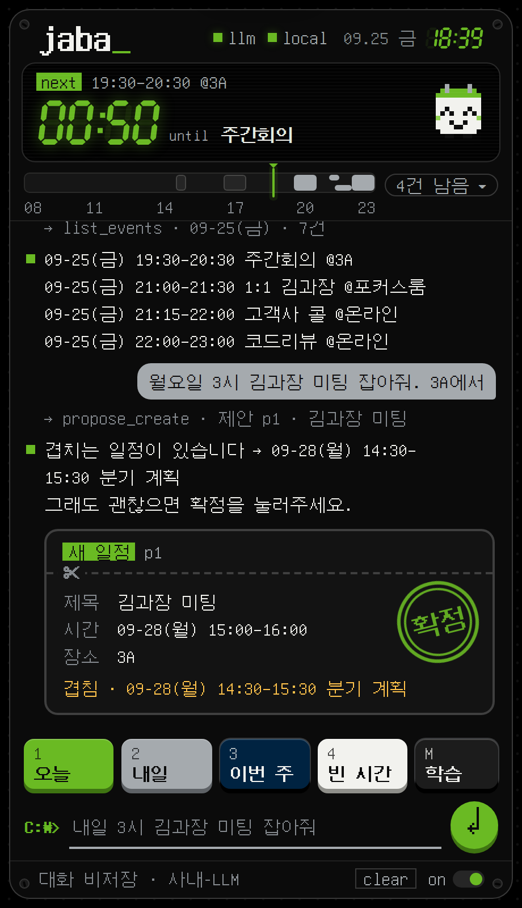

# jaba

사내 일정 비서. 텍스트로 대화하면 일정을 조회·제안·정리하고, **확정 버튼을 눌러야만** 캘린더에 반영합니다.
사내 LLM(OpenAI 호환 API)에 붙고, 내 PC에서만 돕니다.

<p align="center"></p>

- **파일 하나** — `jaba.py`만 있으면 실행됩니다. 표준 라이브러리만 씁니다 (Outlook 연동 때만 `pywin32`)
- **제안 → 확정** — 만들기·바꾸기·지우기는 카드로 먼저 보여주고, 확정 전엔 캘린더를 건드리지 않습니다
- **로컬 학습** — "앞으로 스크럼은 15분으로 잡아" (학습 카드 **확정** 후) 또는 `/학습 …` → `jaba_rules.json`에 저장, 모든 제안·정리에 우선 적용
- **일정 위키** — "내일 김과장 미팅 준비물은 견적서랑 노트북, 안건은 단가 협상" → 목적·안건·준비·참석자·결정·메모·링크로 정리한 위키 카드 → **확정**. 반복 회의는 같은 제목 일정 모두에 붙고, 다음 일정 칸의 `위키` · 일정 서랍의 `W` · **Alt+W** · `/위키` 로 언제든 열고, 알림에는 준비물이 같이 뜹니다. "이따 회의 준비물 뭐였지?"라고 물어도 위키를 보고 답합니다 (`jaba_wiki.json`)
- **윈도우 알림** — 장소 있는 일정 15·5·1분 전, 장소 없는 일정 5·1분 전
- **내 PC 전용** — `127.0.0.1`에만 열리고 대화는 저장하지 않습니다 (확정한 위키 카드의 '원문 기록'만 `jaba_wiki.json`에 — 카드에 미리 보입니다). 밖으로 나가는 통신은 설정한 LLM 주소뿐
- **도스 픽셀 폰트 내장** — 한글 11,172자가 들어간 GNU Unifont 부분집합을 `jaba.py` 안에 넣었습니다. 설치·인터넷 없이 그대로 보입니다

## 설치 — OpenCode 에게 맡기기 (권장)

OpenCode 에 아래를 붙여넣으면 [`INSTALL.md`](INSTALL.md) 순서대로 `D:\OPENCODE\jaba` 에 설치합니다. `<저장소 주소>`만 바꾸세요.

```text
jaba 를 설치해줘. 설치 위치는 D:\OPENCODE\jaba 야.
1. 코드 받기: git clone <저장소 주소> "D:\OPENCODE\jaba"
   (git 이 안 되면 D:\OPENCODE\jaba-repo.zip 을 D:\OPENCODE 에 풀어)
2. 그다음 D:\OPENCODE\jaba\INSTALL.md 를 끝까지 읽고 그 순서대로만 진행해.
   API 키·토큰은 절대 출력하지 말고, [질문] 표시가 있는 곳에서는 나한테 물어봐.
```

LLM 설정은 OpenCode 설정(`opencode.json`)에서 `--setup` 이 그대로 가져옵니다. 키 값은 화면·대화 어디에도 찍히지 않습니다.

## 직접 설치 (Windows · Python 3.8+)

```bat
git clone <저장소 주소> "D:\OPENCODE\jaba"
cd /d D:\OPENCODE\jaba
python jaba.py --setup           :: OpenCode 설정에서 LLM 값 가져오기 + 점검 (config.json · jaba.bat 생성)
python jaba.py --test-notify     :: 윈도우 알림이 뜨는지 확인
python jaba.py --autostart on    :: (선택) 로그인할 때 자동 실행
```

그다음부터는 `jaba.bat`을 더블클릭하거나, 어디서든 **Ctrl+Alt+J**. 설정 바꾸기는 `python jaba.py --set "키=값"` (예: `--set "llm.tool_mode=json"`).

## 설정 (`config.json`)

| 키 | 설명 |
|---|---|
| `llm.base_url` | 사내 LLM 주소 (OpenAI 호환, 보통 `…/v1`) |
| `llm.model` · `llm.api_key` | 모델 이름 · 키. 키는 `"{env:환경변수이름}"` · `"{file:경로}"` 참조도 됩니다 (OpenCode 와 같은 문법) |
| `llm.models` | 화면 아래 **모델 드롭다운**에 늘 보일 모델 목록 (선택). 서버의 `/v1/models` 목록과 합쳐 보여 주고, 고르면 `llm.model` 에 저장. `--setup` 이 OpenCode 설정의 모델들을 넣어 둠 |
| `llm.tool_mode` | `auto`(기본) · `native` · `json` — 도구 호출이 불안정하면 `json` |
| `llm.proxy` · `llm.ca_file` | 프록시 (`""` = 안 씀) · 사내 인증서 PEM (SSL 오류 날 때만) |
| `calendar.backend` | `local`(기본, `jaba.db`) · `outlook`(클래식 Outlook + `pip install pywin32`) |
| `alerts` | `with_location` `[15, 5, 1]` · `without_location` `[5, 1]` · `windows_toast` |
| `reminder_minutes` | jaba로 만든 Outlook 일정의 Outlook 자체 알림(분). 알림이 겹치면 `0` |
| `work_hours` | 업무시간·요일 — 빈 시간 찾기와 경고 기준 |
| `theme` | `dark`(기본) · `light` · `system` |
| `hotkey` | 전역 단축키 (기본 `ctrl+alt+j`, `""`이면 끔) |

전체 기본값은 [`config.example.json`](config.example.json), 설명은 `jaba.py` 맨 위에 있습니다.

## 쓰는 법

- 화면 맨 아래: `로컬 저장`(일정·학습 규칙·위키는 이 PC 파일에만, 대화는 끄면 사라짐) · **모델 드롭다운** (바꾸면 다음 실행에도 유지)

- "내일 3시 김과장 미팅 잡아줘" → 제안 카드 → **확정** (Ctrl+Enter · `ㅇㅇ`) / 취소 (Esc · `ㄴㄴ`)
- 빠른 키 **Alt+1~4** · 오늘 일정 펼치기 **Alt+D** · 학습 서랍 **Alt+M** · 일정 위키 **Alt+W**
- 명령어: `/학습 <규칙>` · `/잊어 r3` · `/규칙` · `/위키 [검색]` · `/알림` · `/도움`

## 개발

| 할 일 | 명령 |
|---|---|
| UI 수정 | `ui.html` 수정 → `python build.py` (jaba.py에 내장됨 · `INDEX_HTML`을 직접 고치지 말 것) |
| 반영 확인 | `python build.py --check` (UI · 폰트 둘 다) |
| 폰트 다시 만들기 (선택) | `pip install fonttools` → `python tools/make_font.py <unifont.otf>` → `python build.py` |
| 테스트 | `python -m unittest tests.test_jaba` (표준 라이브러리만) |
| 브라우저 E2E (선택 · CI 에서는 자동) | `pip install playwright` → `python -m playwright install chromium` → `python tests/e2e_ui.py` (시간대는 알아서 낮으로 맞춤) |

`tests/fake_llm_server.py`는 OpenAI 호환 가짜 서버라서 사내 LLM 없이도 전체 흐름을 돌려볼 수 있습니다.

## 커밋하면 안 되는 것

`config.json`(API 키) · `jaba.db`(일정) · `jaba_rules.json`(학습 규칙) · `jaba_wiki.json`(일정 위키) · `jaba.bat`(PC별 경로) — 모두 `.gitignore`에 들어 있습니다.

## 알려진 한계

- Outlook: 반복 일정·회의 초대는 읽기만 하고(변경은 Outlook에서) 초대 메일은 보내지 않습니다. 새 Outlook은 지원하지 않습니다
- 윈도우 알림은 PowerShell로 띄웁니다. 회사 정책이 막으면 앱 안 알림으로만 동작합니다 (`--test-notify`로 확인)
- 알림은 jaba가 켜져 있을 때만 옵니다
- 픽셀 폰트는 윈도우 배율 100%·200%에서 가장 선명하고, 125%·150%에선 살짝 부드럽게 보입니다. 한자·이모지는 시스템 글꼴로 나옵니다

## 라이선스

내장 폰트는 [GNU Unifont](https://unifoundry.com/unifont/) 15.1.01의 부분집합이고 SIL Open Font License 1.1을 따릅니다 ([`fonts/OFL.txt`](fonts/OFL.txt)).
저작권 표기와 라이선스 전문은 `jaba.py` 맨 아래와 폰트 파일 안에도 들어 있습니다.
