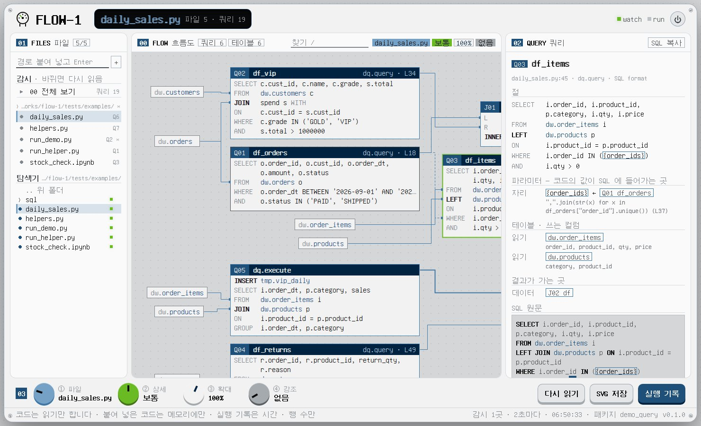
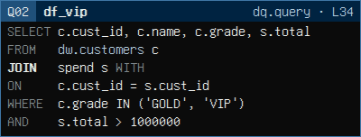
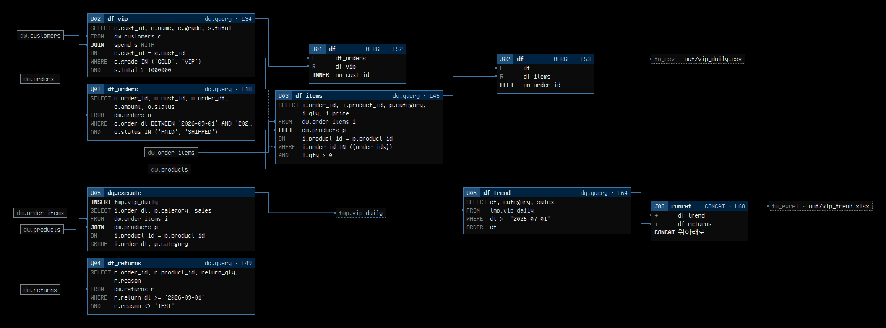
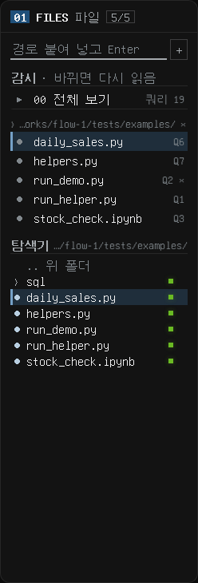
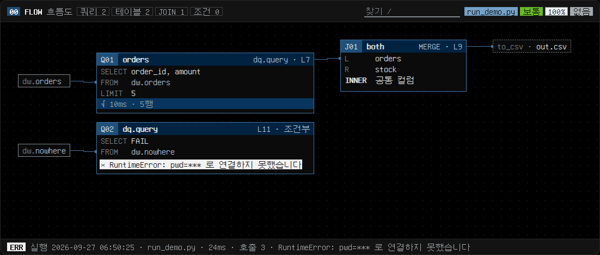
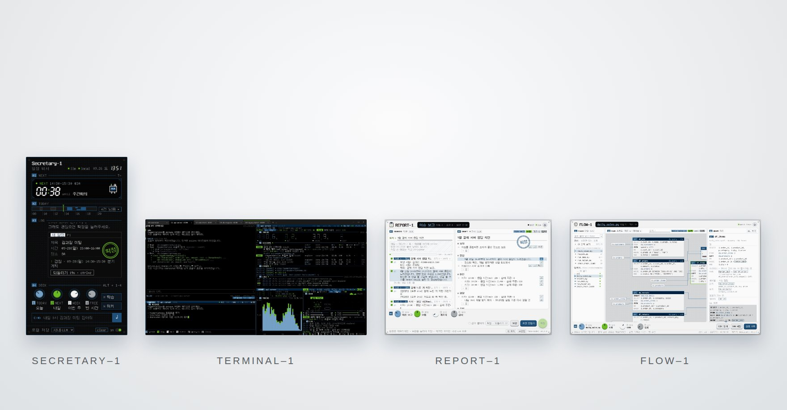
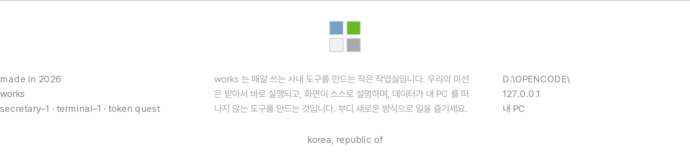

<p align="center">
  <picture>
    <source media="(prefers-color-scheme: dark)" srcset="docs/page/hero-dark.jpg">
    
  </picture>
</p>

<p align="center">
  <picture>
    <source media="(prefers-color-scheme: dark)" srcset="docs/page/title-dark.png">
    
  </picture>
</p>

<p align="center">
쿼리 여섯 개, 판다스 병합 두 번, 임시 테이블 하나. 남이 짠 분석 스크립트를 처음 열었을 때를 위해 만들었습니다. 몇 가지만 꼽으면:<br>
쿼리마다 SELECT · FROM · JOIN · WHERE 가 카드 한 장에, 쿼리 사이의 조인 · 조건 · 병합이 선으로 이어집니다.<br>
테이블 선은 그 테이블이 나오는 줄에, 점선은 앞 쿼리의 결과가 다음 쿼리의 조건으로 들어가는 자리에 붙습니다.<br>
전부는 아니고, 이 정도입니다:
</p>

<p align="center"><sub>
파이썬 · 노트북(.IPYNB) · %%SQL 셀 · .SQL 파일 · 붙여 넣기<br>
쿼리 카드 = SELECT · FROM · JOIN · WHERE · GROUP · ORDER<br>
WITH · 서브쿼리 · UNION · INSERT · CREATE AS · MERGE<br>
HIVE · SPARK · PRESTO · ORACLE 이 섞여도 멈추지 않음<br>
F-STRING · FORMAT · % · += · .SQL 파일을 따라가 SQL 을 되살림<br>
앞 쿼리 결과 → 다음 쿼리의 조건 · 점선<br>
MERGE · JOIN · CONCAT · 출력(TO_CSV …) · 임시 테이블의 쓰기 → 읽기<br>
함수 · 반복문 · 클래스 메서드는 부른 자리마다 펼침<br>
사내 쿼리 패키지 이름을 몰라도 SQL 모양 인자로 찾음<br>
옆에 탐색기 · 누르면 흐름도 · + 로 감시 고정<br>
파일이 바뀌면 다시 그림 · --RUN 으로 쿼리마다 걸린 시간 · 행 수<br>
찾기 · JOIN 강조 · 조건 강조 · SVG 저장 · --SCAN 글 요약<br>
127.0.0.1 전용 · 실행마다 새 토큰 · 코드는 읽기만<br>
유량계 바늘 · 읽을 때 휘젓고 쿼리가 도는 동안 떨림<br>
다크 · 라이트 · 시스템 테마 · 빨강 없음<br>
설치는 OPENCODE 에게 · INSTALL.MD · 사내 LLM 가공 가이드 · GUIDE.MD<br>
단위 · 통합 테스트 86 · 브라우저 E2E · WINDOWS + UBUNTU CI
</sub></p>

<p align="center"><a href="#install">설치하기 ›</a></p>

<br>

<h3 align="center">SELECT · FROM · WHERE 가, 카드 한 장에.</h3>

<p align="center">
쿼리 하나 = 카드 하나. 머리에는 결과를 받는 변수와 부른 줄, 몸통에는 절마다 한 줄씩.<br>
JOIN 줄은 조인 종류(LEFT · INNER · FULL …)를 굵게, ON 조건을 바로 아래에. WHERE 조건은 AND 마다 한 줄입니다.<br>
② 상세 노브로 간단(FROM · JOIN 만) · 보통 · 전부(WITH · 모든 컬럼 · 경유한 함수)를 오갑니다.
</p>

<p align="center"></p>
<p align="center"><sub>Q02 · SELECT · FROM · JOIN(WITH) · ON · WHERE · AND</sub></p>

<br>

<h3 align="center">조인은, 그 줄에 붙습니다.</h3>

<p align="center">
테이블에서 오는 선은 카드의 가운데가 아니라 그 테이블이 나오는 FROM · JOIN 줄로 들어갑니다. WITH 안에서 읽은 테이블은 그 WITH 를 쓰는 줄로.<br>
앞 쿼리의 결과가 다음 쿼리의 <code>IN ({order_ids})</code> 로 들어가면 점선이 그 WHERE 줄에 붙고, 판다스 병합은 L · R 와 조인 키가 적힌 병합 카드가 됩니다.<br>
임시 테이블에 쓰고 다시 읽으면 쓰기 → 테이블 → 읽기로 이어집니다. 파일 여러 개를 <code>00 전체</code> 로 보면 같은 테이블로 서로 이어집니다.
</p>

<p align="center"></p>
<p align="center"><sub>00 FLOW · 테이블 → 줄 · 조건 점선 · 병합 L · R · 임시 테이블 · 출력</sub></p>

<br>

<h3 align="center">옆에, 탐색기.</h3>

<p align="center">
드라이브 · 홈부터 폴더를 펼쳐 파이썬 파일을 누르면 바로 흐름도가 나옵니다. SQL 이 들어 있어 보이는 파일에는 <code>●</code>.<br>
누르기는 이번만 열기(설정에 남지 않음), <code>+</code> 는 감시 목록에 고정 — 파일이 바뀔 때마다 다시 읽어 흐름도를 다시 그립니다.<br>
코드를 복사해 그냥 붙여 넣어도(Ctrl+V) 됩니다. 붙여 넣은 코드는 메모리에만 둡니다.
</p>

<p align="center"></p>
<p align="center"><sub>01 FILES · 감시 · 이번만 연 파일 · 붙여 넣은 것 · 탐색기</sub></p>

<br>

<h3 align="center">돌려 보면, 시간이 보입니다.</h3>

<p align="center">
<code>python flow-1.py --run 스크립트.py</code> 로 돌리면 흐름도에 있는 쿼리 호출마다 걸린 시간 · 행 수 · 성공이 카드 아래에 붙습니다.<br>
돌아가는 동안은 그 카드가 <code>◐</code> 로 깜빡이고, 실패한 쿼리는 <code>ERR</code>. 지난 실행은 <code>04 RUNS</code> 에서 골라 겹쳐 봅니다.<br>
남기는 것은 시각 · 걸린 시간 · 행 수 · 오류 이름뿐입니다. SQL 원문 · 결과 데이터 · 명령줄 인자는 남기지 않습니다.
</p>

<p align="center"></p>
<p align="center"><sub>00 FLOW · √ 걸린 시간 · 행 수 · 막대 · ◐ 실행 중 · ERR</sub></p>

<br>

<h3 align="center">사내 패키지 이름을, 몰라도.</h3>

<p align="center">
인자에 SQL 이 들어간 호출이면 쿼리로 봅니다 — <code>spark.sql(…)</code> 이든 사내 패키지의 <code>query(…)</code> 든 이름을 몰라도 잡힙니다.<br>
SQL 이 변수라 코드만으로 못 읽는 호출까지 잡으려면 설치할 때 사내 패키지 이름 하나만 알려 주세요. 이 PC 설정에만 저장합니다.<br>
사내 LLM 이 이어서 고칠 수 있게 코드 지도 · 규칙 · 화면 치수 · 작업 절차를 <a href="docs/GUIDE.md">GUIDE.md</a> 한 곳에 적었습니다.
</p>

<br>

<h3 align="center">works 시스템.</h3>

<p align="center">
Flow–1 은 works 시스템의 한 부품입니다.<br>
같은 팔레트, 같은 번호 라벨, 같은 노브 색으로 만든 사내 도구들.<br>
전부 받아서 바로 실행하고, 전부 내 PC 에서만 돕니다.
</p>

<p align="center"><a href="../README.md">explore ›</a></p>

<p align="center">
  <picture>
    <source media="(prefers-color-scheme: dark)" srcset="../docs/page/system-dark.jpg">
    
  </picture>
</p>

<br>

<a name="specs"></a>
<h3 align="center">사양.</h3>

<table align="center">
<tr><td width="140">실행</td><td width="560">Windows 10 / 11 · Python 3.8+</td></tr>
<tr><td>의존성</td><td>없음 — 표준 라이브러리만 (분석할 스크립트의 판다스 · 사내 패키지는 --run 할 때만 그 스크립트가 쓴다)</td></tr>
<tr><td>배포</td><td><code>flow-1.py</code> + 분석 모듈 네 개 · UI 와 폰트는 <code>flow1_assets.py</code> 에 내장</td></tr>
<tr><td>읽는 것</td><td><code>.py</code> · <code>.ipynb</code> · <code>.sql</code> · 붙여 넣은 코드 · 파일 하나 2 MB · 감시 파일 400개 (<code>scan.max_files</code>)</td></tr>
<tr><td>SQL</td><td>WITH · SELECT · FROM · JOIN · WHERE · GROUP · HAVING · ORDER · LIMIT · UNION · INSERT · CREATE AS · UPDATE · DELETE · MERGE · LATERAL VIEW</td></tr>
<tr><td>저장</td><td><code>%LOCALAPPDATA%\flow-1\</code> — <code>config.json</code> · <code>runs\</code>(실행 기록) — 코드 · SQL · 데이터는 남기지 않음</td></tr>
<tr><td>네트워크</td><td><code>127.0.0.1</code> 전용 · 실행마다 새 토큰 · 밖으로 나가는 통신 없음</td></tr>
<tr><td>키</td><td><code>Ctrl+V</code> 붙여 넣기 · <code>/</code> 찾기 · <code>[</code> <code>]</code> 앞 · 뒤 쿼리 · <code>+</code> <code>-</code> <code>0</code> 확대 · <code>R</code> 다시 읽기 · <code>Alt+1–4</code> 노브 · <code>Esc</code></td></tr>
<tr><td>글꼴</td><td>GNU Unifont 15.1.01 부분집합 · SIL OFL 1.1 (<a href="fonts/OFL.txt">fonts/OFL.txt</a>)</td></tr>
<tr><td>테스트</td><td>단위 · 통합 86 · 골든 요약 3 · 브라우저 E2E · CI Windows + Ubuntu × Python 3.8 · 3.13</td></tr>
</table>

<br>

<a name="install"></a>
<h3 align="center">설치.</h3>

<p align="center">OpenCode 에 아래를 붙여넣으면 <a href="INSTALL.md">INSTALL.md</a> 순서대로 <code>D:\OPENCODE\flow-1</code> 에 설치합니다. 사내 쿼리 패키지 이름은 설치하면서 물어봅니다.</p>

```text
Flow–1 을 설치해줘. works 저장소를 D:\OPENCODE 에 받고, 프로그램 폴더는 D:\OPENCODE\flow-1 이야.
1. 코드 받기: D:\OPENCODE 가 없거나 비어 있으면 git clone https://github.com/leebobegogigug-blip/Works.git "D:\OPENCODE"
   (이미 works 가 받아져 있으면 받지 말고, git 이 안 되면 Works-repo.zip 을 D:\OPENCODE 에 풀어)
2. 그다음 D:\OPENCODE\flow-1\INSTALL.md 를 끝까지 읽고 그 순서대로만 진행해.
   API 키·토큰은 절대 출력하지 말고, [질문] 표시가 있는 곳에서는 나한테 물어봐.
```

<br>

<h3 align="center">설치비 0원 · 의존성 0개<br>반품은 한 줄이면 끝*</h3>

<p align="center"><sub>*<code>--shortcut off</code> 로 시작 메뉴 바로가기를 지우면 PC 에 남는 건 <code>%LOCALAPPDATA%\flow-1</code> 뿐 — 자세한 순서는 <a href="INSTALL.md#제거">INSTALL.md › 제거</a></sub></p>

<br>

<table align="center">
<tr><td width="620"><a href="INSTALL.md">설치 가이드</a> <sub>· OpenCode 에이전트용 단계별 절차 · 업데이트 · 제거</sub></td><td align="right" width="40">›</td></tr>
<tr><td><a href="docs/MANUAL.md">매뉴얼</a> <sub>· 설정 · 쓰는 법 · 찾는 규칙 · 화면 · 실행 기록</sub></td><td align="right">›</td></tr>
<tr><td><a href="docs/GUIDE.md">사내 LLM 가공 가이드</a> <sub>· 코드 지도 · 데이터 모델 · 분석 규칙 · 화면 치수 · 작업 절차 · 프롬프트</sub></td><td align="right">›</td></tr>
<tr><td><a href="../docs/DESIGN.md">디자인</a> <sub>· works 공통 원칙 일곱 가지 · 팔레트</sub></td><td align="right">›</td></tr>
<tr><td><a href="https://github.com/leebobegogigug-blip/Works/issues">문제 알리기</a> <sub>· 이슈</sub></td><td align="right">›</td></tr>
<tr><td><a href="../README.md">works</a> <sub>· 시스템 전체 · 다른 부품</sub></td><td align="right">›</td></tr>
</table>

<br>

<p align="center">
  <picture>
    <source media="(prefers-color-scheme: dark)" srcset="../docs/page/colophon-dark.png">
    
  </picture>
</p>

<p align="center"><sub>
Flow–1 · 쿼리가 어디서 와서 어디로 가는지는 보여 드립니다. 왜 그렇게 짰는지는 짠 분께 물어보셔야 합니다.<br>
내장 폰트 GNU Unifont 15.1.01 부분집합 · SIL OFL 1.1 (<a href="fonts/OFL.txt">fonts/OFL.txt</a>)<br>
화면 문법은 소형 하드웨어 계측기(Teenage Engineering 류)에서 영감을 받았고, 해당 회사와는 관련이 없습니다.
</sub></p>
