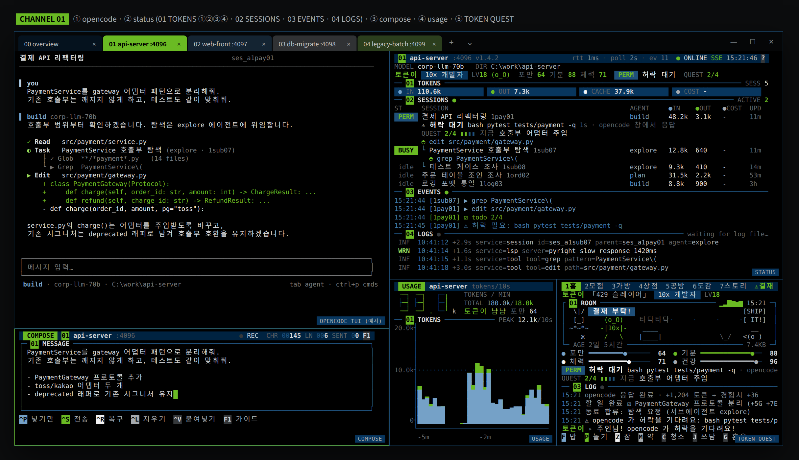
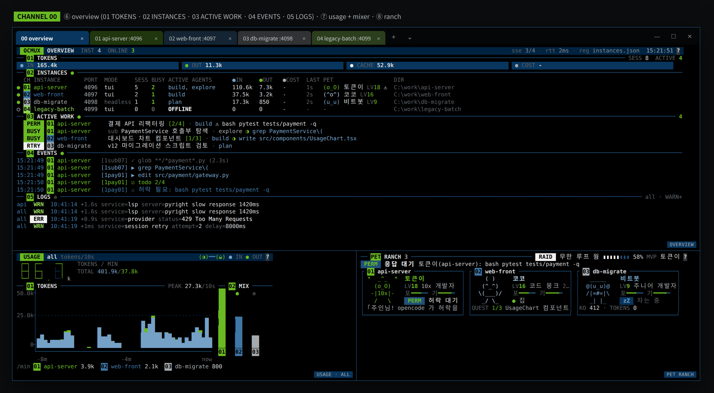
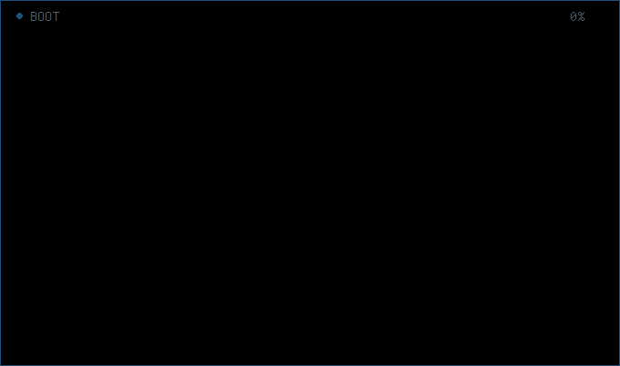
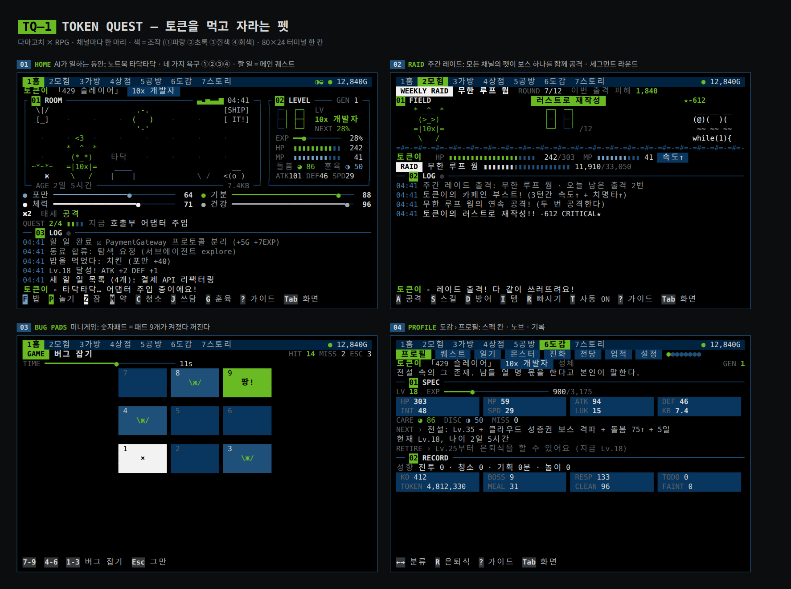
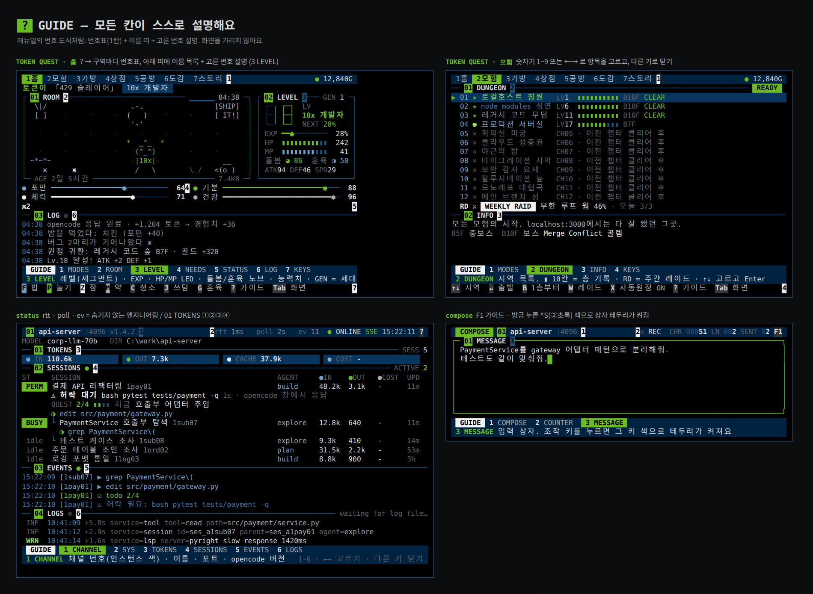
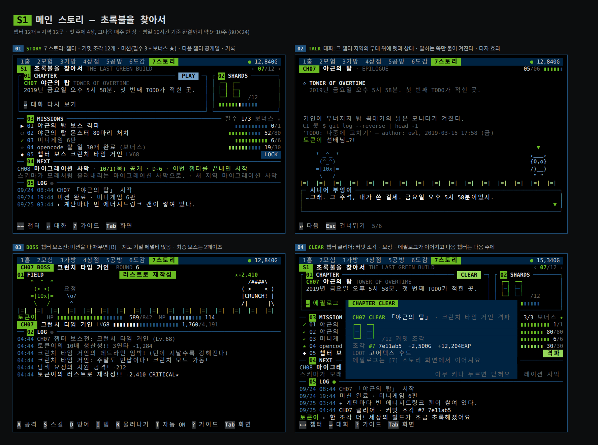

# ocmux

**opencode 여러 개를 Windows Terminal 한 창에서.**
채널(탭)마다 opencode · 상태판 · 입력창 · 토큰 사용량이 한 화면에 모이고, `00 overview` 탭에서 모든 채널을 한눈에 봅니다.
그리고 그 토큰을 먹고 자라는 펫 RPG, **TOKEN QUEST (TQ–1)** 가 같이 삽니다.

`Windows 10/11` `Windows Terminal` `PowerShell 5.1+` `Python 3.8+ · 표준 라이브러리만` `opencode`



<sub>채널 01 화면. ① opencode ② status ③ compose ④ usage ⑤ TOKEN QUEST — 왼쪽 위 opencode 화면과 데이터는 예시입니다.</sub>

---

## 01 왜 만들었나

opencode를 프로젝트마다 하나씩 띄워 두면, 창을 오가며 확인할 것이 많아집니다.

- 지금 **어느 창이 일하는 중**인지, 서브에이전트는 무엇을 하는지
- 어디서 **허락(permission)이나 질문**에 막혀 나를 기다리고 있는지
- **토큰**이 얼마나 나가는지, 에러나 재시도는 없는지

ocmux는 tmux처럼 여러 인스턴스를 한 창에 묶고, opencode 서버의 HTTP/SSE API를 직접 읽어서
**세션 · 할 일 · 허락 대기 · 토큰 · 로그**를 채널마다 한 화면에 모아 줍니다.
모델은 상관없습니다. opencode에 붙는 LLM이면 무엇이든(사내 LLM 포함) 그대로 동작합니다.

하루 종일 켜 두는 화면이니 조금은 즐거워도 되겠다 싶어서, 토큰을 먹고 자라는 펫도 넣었습니다.

## 02 기능

| | 기능 | 내용 |
|---|---|---|
| 01 | **채널 = 탭** | `ocmux add` 한 번에 탭 하나. opencode · status · compose · usage · 펫이 5분할로 열립니다. 채널 번호(01, 02 …)는 한 번 정해지면 바뀌지 않습니다 |
| 02 | **status** | 토큰 4값(①IN ②OUT ③CACHE ④COST) · 세션 트리(서브에이전트 포함) · 할 일 진행 · 실시간 이벤트 · 로그 |
| 03 | **허락 대기 알림** | opencode가 permission/question에서 멈추면 `PERM` `ASK` 칩이 깜빡이고, overview와 펫 화면에도 뜹니다 |
| 04 | **compose** | 큰 입력창에서 쓰고 opencode로 전송. 붙여넣기 글자 누락 방지, 마지막으로 보낸 글 복구 |
| 05 | **usage** | 분당 토큰(세그먼트 숫자) + 10초 막대 차트. overview에서는 채널별 믹서 |
| 06 | **00 overview** | 모든 채널의 토큰 합계 · 인스턴스 표 · 진행 중 작업 · 이벤트 · WARN 이상 로그 |
| 07 | **TOKEN QUEST** | 채널마다 펫 한 마리. 토큰 = 밥·경험치, AI가 일하는 동안 던전 원정, opencode 할 일 = 메인 퀘스트, 매주 한 장씩 열리는 메인 스토리 12챕터 |
| 08 | **`?` 가이드** | 어느 창에서든 `?`(compose는 `F1`)를 누르면 구역마다 번호표와 설명이 붙습니다. 화면이 스스로 설명합니다 |
| 09 | **가벼운 설치** | Python 표준 라이브러리만 사용. `pip install` 없이 폴더 + PATH가 전부입니다 |

## 03 화면

### 채널 탭 · `01 api-server :4096`

```
┌──────────────────┬──────────────────────────┐
│ 1 opencode TUI   │ 2 status                 │
│                  │   01 TOKENS  02 SESSIONS │
│                  │   03 EVENTS  04 LOGS     │
├──────────────────┼───────────┬──────────────┤
│ 3 compose        │ 4 usage   │ 5 TOKEN QUEST│
└──────────────────┴───────────┴──────────────┘
```

| | 창 | 보여 주는 것 |
|---|---|---|
| ① | opencode TUI | opencode 그 자체 |
| ② | status | 토큰 4값 · 세션 트리 · 이벤트 · 로그 · 펫 배지 |
| ③ | compose | 큰 입력창 → opencode (포커스가 여기서 시작) |
| ④ | usage | 분당 토큰 + 10초 막대 차트 |
| ⑤ | TOKEN QUEST | 이 채널의 펫 |

### 00 overview · 모든 채널



⑥ overview (01 TOKENS · 02 INSTANCES · 03 ACTIVE WORK · 04 EVENTS · 05 LOGS) · ⑦ usage + 채널별 믹서 · ⑧ 펫 목장 + 이번 주 레이드

### TOKEN QUEST





### `?` 가이드 · 모든 칸이 스스로 설명



어느 창에서든 `?`(compose에서는 `F1`)를 누르면 구역마다 번호표가 붙고, 아래 띠에 이름과 설명이 나옵니다.
`1`–`9` 또는 `←` `→`로 항목을 고르고, 다른 키를 누르면 닫힙니다. 가이드가 열려 있는 동안에는 키가 다른 동작을 하지 않습니다.

## 04 설치

**필요한 것**

- Windows 10/11 + [Windows Terminal](https://aka.ms/terminal) (`wt`)
- PowerShell 5.1 이상 (Windows 기본 포함)
- Python 3.8 이상. 표준 라이브러리만 씁니다. `py -3`가 있으면 그것을, 없으면 `python`을 씁니다 (`-Python`으로 지정 가능)
- [opencode](https://opencode.ai) CLI (`PATH`에 있어야 합니다)

**설치**

```powershell
git clone <저장소 주소> C:\tools\ocmux

# 사용자 PATH에 추가 (새로 연 터미널부터 적용)
$p = [Environment]::GetEnvironmentVariable('Path', 'User')
[Environment]::SetEnvironmentVariable('Path', "$p;C:\tools\ocmux", 'User')
```

처음 `ocmux add`를 한 뒤(또는 업데이트한 뒤)에는 Windows Terminal 창을 **모두** 한 번 닫았다가 여세요.
그래야 `ocmux Black` 색 테마가 로드됩니다.

> PowerShell 실행 정책 때문에 `ocmux`가 막히면 `ocmux.cmd add`처럼 `.cmd`로 실행하세요. 내부에서 `-ExecutionPolicy Bypass`로 스크립트를 실행합니다
> (그룹 정책으로 강제된 실행 정책은 우회하지 않습니다).

## 05 사용법

```powershell
cd C:\work\api-server
ocmux add            # 현재 폴더 → 새 채널 (첫 add 때는 00 overview 탭도 함께 열림)
```

| 명령 | 하는 일 |
|---|---|
| `ocmux add` | 현재 폴더 → 새 채널 (4096번부터 빈 포트) |
| `ocmux add C:\work\web -Name web` | 다른 프로젝트를 새 채널로 |
| `ocmux add C:\work\api -Headless` | 숨은 `opencode serve` + attach 화면 (탭을 닫아도 서버는 유지) |
| `ocmux add -PetName 코코` | 새 펫 알에 이름 붙이기 (기본: 토큰이) |
| `ocmux overview` | `00 overview` 탭 다시 열기 |
| `ocmux ls` | 채널 표 + 상태 LED |
| `ocmux focus api` | 닫은 채널을 같은 포트로 다시 열기 |
| `ocmux rm api` | 등록 해제 (headless 서버는 종료, 펫 저장은 남음) |
| `ocmux prune` | 꺼진 채널 정리 |
| `ocmux setup` | `ocmux Black` 색 테마 설치 |
| `ocmux help` | 도움말 |

```
PS> ocmux ls
 CH  NAME               PORT   MODE      STATE      DIR
 01  api-server         4096   tui       ● online   C:\work\api-server
 02  web-front          4097   tui       ● online   C:\work\web-front
 03  db-migrate         4098   headless  ○ offline  C:\work\db-migrate
```

- 레이아웃: `-RightWidth 0.5` `-BottomHeight 0.42` `-GameWidth 0.58` `-ComposeHeight 0.30` `-Compact`(아래 줄 없음) `-NoLogs` `-NoCompose`
- 기타: `-Port` `-BasePort` `-NoOverview` `-Python "py -3"`
- 비밀번호가 걸린 opencode 서버: 환경 변수 `OPENCODE_SERVER_PASSWORD`를 설정하면 모든 창이 그대로 사용합니다.

**자주 쓰는 키**

| 창 | 키 |
|---|---|
| 어디서나 | `?` 가이드 (compose에서는 `F1`) |
| status | `i` 쉬고 있는 서브에이전트 세션 보이기/숨기기 |
| compose | `Ctrl+S` 전송 · `Ctrl+P` 넣기만 · `Ctrl+R` 복구 · `Ctrl+L` 지우기 · `Enter` 줄바꿈 · `Ctrl+V`/`Insert` 붙여넣기 |
| TOKEN QUEST | `1`–`7`·`Tab` 화면 · `F` 밥 · `P` 놀기 · `Z` 잠 · `M` 약 · `C` 청소 · `J` 쓰담 · `G` 훈육 |
| TOKEN QUEST `7` 스토리 | `←` `→` 챕터 · `Enter` 대화 · `B` 챕터 보스 · 대화 중 `Enter` 다음 줄 · `Esc` 건너뛰기 |
| Windows Terminal | `Alt+방향키` 창 이동 · `Alt+Shift+방향키` 크기 조절 · `Ctrl+Tab` 탭 전환 |

**opencode 없이 먼저 보기**

```powershell
cd C:\tools\ocmux

# 펫만 띄워 보기 (알에서 시작)
py -3 oc_monitor.py rpg --name demo

# 이미 떠 있는 opencode(--port 4096)에 상태판만 붙이기
py -3 oc_monitor.py status --url http://127.0.0.1:4096
```

## 06 TOKEN QUEST

다마고치처럼 돌보고, RPG처럼 키웁니다. 채널마다 한 마리가 살고, opencode 활동이 곧 먹이이자 모험입니다.

| opencode에서 | 게임에서 |
|---|---|
| 토큰 사용 | 밥(포만 60까지) · 경험치(1,000토큰 = 1, 하루 200만 토큰부터 덜 오름) · MP, 입력 토큰은 INT |
| 세션이 일하는 중 (BUSY) | 자동 원정을 떠나거나, 집에서 노트북을 두드립니다 |
| 응답 도착 (idle) | 퀘스트 보상, 원정대가 전리품을 들고 귀환 |
| `todo` 목록 | **메인 퀘스트**. 항목마다 보상, 목록을 끝내면 보너스 |
| 허락 · 질문 대기 | "결재 부탁!" 팻말 + 상단 `⚠결재`. 빨리 답하면 보너스 |
| 서브에이전트 | 동료로 합류해 같이 싸우고 선물을 남김 |
| 도구 호출 | 제작 재료. 도구 에러는 버그 |
| `session.error` | 버그 · 기분 하락 · **보스** (레이트 리밋이면 429 드래곤) |
| compose로 보내기 | 반응 + 10분 "영감" 버프 |

- **돌봄** 포만① · 기분② · 체력③ · 건강④ + 방에 쌓이는 버그. 부르면 25분 안에 답해 주세요. 떼쓰기엔 `G` 훈육
- **성장** 알 → 비트 → 바이트 → 청소년 → 성체 → 전설. 키운 방식이 진화를 정합니다
  (전투 → *10x 개발자*, 청소 → *버그 헌터*, 계획 → *시니어 아키텍트*, 방치 → *야근 좀비* …) + 성격 7종
- **모험** 12지역 × 10층, 중간 보스 B5F · 보스 B10F, 몬스터 78종 + 챕터 보스 12, 선택지 이벤트, 장비 +10 강화, 방 꾸미기
- **주간 레이드** 모든 채널의 펫이 보스 하나를 함께 공격. 하루 3번 출격, 12라운드, 보상 + MVP
- **미니게임** 방향 맞히기 · 버그 잡기(숫자패드) · 타자 · 개발 OX 퀴즈
- **세대** 성체 Lv.25 + 3일이면 은퇴 → 명예의 전당 → 새 알. 골드 · 가방 · 업적 · 스토리 진행은 이어지고, 조상 수만큼 보너스

### 메인 스토리 · 시즌 1 「초록불을 찾아서」



> 어느 월요일 아침, 세상의 모든 빌드가 동시에 빨갛게 물들었다.
> '마지막 초록 빌드'는 커밋 조각 열두 개로 쪼개져 흩어졌다고 한다. 첫 조각은 로컬호스트 평원에 있다. …로컬에선 늘 잘 됐으니까.

하루 10시간씩 켜 두는 사람도 몇 주 동안 따라갈 거리가 있도록, **챕터가 매주 한 장씩 열리는** 이야기를 넣었습니다.

- **구성** 챕터 12개 = 지역 12곳. 한 챕터 = 프롤로그 대화 → 미션 3개(+ 보너스 ★) → 챕터 보스 → 에필로그 · 커밋 조각 · 보상
- **미션** 평소처럼 opencode를 쓰면 채워집니다. 지역 보스 격파 · 그 지역 몬스터 처치 · opencode 할 일 완료 ·
  허락 요청에 1분 안에 응답 · 미니게임 · 제작/강화 등
- **공개 일정** 첫 주에는 1~4장을 진행하는 대로 바로, 그다음부터는 시작일 기준 **7일마다 한 장**.
  공개된 챕터는 쌓이므로 며칠 쉬어도 밀린 만큼 이어서 할 수 있습니다
- **챕터 보스** 미션을 다 채우면 `B`로 도전. 대사가 있는 보스전이고, 져도 기절 페널티가 없습니다(HP 50%부터 재도전). 마지막 보스는 2페이즈
- **플레이타임** 평일 10시간 기준 완결까지 **약 9~10주**. 하루 25만~2,500만 토큰으로 돌린 시뮬레이션에서 60~71일, 완결 때 Lv.100 전후
- **토큰 경험치** 하루 200만 토큰까지 100% · 1,000만까지 25% · 그 뒤 5%. 토큰을 아주 많이 쓰는 날에도 레벨이 이야기를 앞질러 가지 않게 (밥은 그대로)
- **예전 저장** 업데이트하면 그대로 이어집니다. 이미 깬 지역만큼 앞 챕터가 먼저 열리고, 미션은 업데이트한 순간부터 셉니다

새 챕터 · 보스 도전 · 에필로그가 기다리면 탭 이름 `7스토리` 옆 LED가 깜빡이고 홈 화면에 `STORY` 칩이 뜹니다.
목장 카드에는 펫마다 지금 챕터와 미션 진행이 보입니다.

## 07 디자인

모든 창이 같은 규칙 일곱 가지를 따릅니다.
Teenage Engineering 같은 소형 하드웨어 계측기(신스 · 샘플러 · 포켓 레코더)의 화면 철학에서 영감을 받았습니다.
특정 제품의 화면이나 로고를 가져오지 않았고, 해당 회사와는 관련이 없습니다.

| # | 규칙 | 어디서 보이나 |
|---|---|---|
| 1 | **한 화면 = 한 모드, 큰 값 4개** | 펫: 욕구 4개 · status/overview: 토큰 4값 · usage: 분당 토큰 |
| 2 | **색 = 조작.** 값이 어떤 키의 색이면 그 키가 그 값을 바꿉니다 | 펫 `F`①포만 `P`②기분 `Z`③체력 `M`④건강 · compose `^P`① `^S`② `^R`③ `^L`④ |
| 3 | **번호 매긴 구역 + `?` 가이드** | 모든 창 (compose는 `F1`) |
| 4 | **엔지니어링을 숨기지 않기.** 실제 상태를 작게 | status `rtt` `poll` `ev` · overview `sse` · 펫 설정 `02 SYS` (저장 시각, fps) |
| 5 | **즉각 반응.** 누른 키에 불, 활동에 LED | 키캡이 라임으로 켜짐 · LOG/EVENTS/SESSIONS 옆 `●` · compose 테두리 번쩍 · REC LED |
| 6 | **사각 격자.** 각진 모서리, 1칸 간격, 앞자리 0 | 스펙 칸 · `01` 채널 · `00145` 테이프 카운터 |
| 7 | **아이콘은 한 표에서만** | `●` `○` `◐` `▶` `✓` `×` `⚠` `☑` `⇣` `!` `▮` `◆` `★` `☆` `◇` |

**색** ① 파랑 `#75A1C7` · ② 라임 `#6ABA23` · ③ 흰색 `#F2F2F3` · ④ 회색 `#A5AAAE` + 네이비 · 그레이 단계, 바탕은 검정.
빨강은 없습니다. 경고는 가장 밝은 흰색입니다.

**움직임** 켤 때 부팅(점 격자 → 세그먼트 워드마크 → 라임 스윕) · 화면 전환 라임 와이프 · 토큰이 흐를 때 도는 테이프 릴 ·
미끄러지는 페이더 · 키캡 점등 · 강화 게이지 → 세그먼트 숫자 · 스토리 대화의 타자 효과(말하는 쪽만 불이 켜짐).
전부 짧고 기계적입니다. 부팅과 대화는 아무 때나 건너뛸 수 있습니다.

## 08 구조

```
ocmux/
├─ ocmux.ps1           명령어 · Windows Terminal 탭/분할 · 채널 레지스트리 · 색 테마
├─ ocmux.cmd           ocmux.ps1을 -ExecutionPolicy Bypass로 실행하는 진입점
├─ oc_monitor.py       창들: status · overview · usage · compose · logs · rpg (opencode HTTP/SSE)
├─ ocmux_term.py       공용 터미널 도구 + 디자인 시스템 (팔레트, 키캡, 세그먼트 숫자, 가이드, 부팅)
├─ ocmux_pet.py        TOKEN QUEST 엔진 (돌봄 · 진화 · 전투 · 레이드 · 스토리 · 저장), 화면 없음
├─ ocmux_pet_data.py   게임 데이터 (몬스터 · 아이템 · 지역 · 대사 · 스토리 챕터), 밸런스는 대부분 여기서
├─ ocmux_pet_ui.py     TOKEN QUEST 화면 (7개 모드 · 오버레이 · 대화 · 연출)
├─ ocmux_pet_run.py    펫 창 실행 루프 · opencode 이벤트 → 게임 신호 · 목장
├─ docs/               GUIDE.md (상세 매뉴얼, 영문) · images/
└─ tests/              unittest 101개
```

```
ocmux add ──wt──▶ Windows Terminal 창 "ocmux"
                   ├─ 00 overview   : oc_monitor.py overview · usage --all · rpg --all
                   └─ 01 api-server : opencode --port 4096
                                      oc_monitor.py status · compose · usage · rpg

oc_monitor.py ──HTTP──▶ opencode (127.0.0.1:4096)
                GET  /session · /session/status · /session/{id}/message · /session/{id}/todo
                SSE  /event
                POST /tui/append-prompt · /tui/submit-prompt          (compose 전송)
```

데이터는 `%LOCALAPPDATA%\ocmux\`에 저장됩니다: `instances.json`(채널 목록) · `pet-<이름>.json`(펫 · 스토리 진행) ·
`raid-<이름>.json`(주간 레이드) · `logs\`(headless 서버 로그).

## 09 개발

```powershell
# 테스트 101개 (표준 라이브러리 unittest)
py -3 -m unittest discover -s tests

# 한 프레임만 찍고 종료 — 스크린샷·점검용 (--guide 를 붙이면 가이드를 켠 화면)
py -3 oc_monitor.py rpg --name demo --once 1 --cols 80 --rows 24

# 모든 옵션
py -3 oc_monitor.py -h
```

테스트 범위: TOKEN QUEST 엔진(돌봄 · 전투 · 진화 · 세대) · 저장 복구(깨진 파일, 새 버전 저장, 시계 역행) ·
opencode 이벤트 연동(세션 · 서브에이전트 · todo · 허락 대기) · 주간 레이드 경계 조건 ·
메인 스토리(주간 공개 · 미션 · 챕터 보스 · 옛 저장 이어받기) · 토큰 경험치 체감 · 모든 화면 렌더링 스모크.

## 10 알려진 한계

- 창 배치(`ocmux.ps1`)는 Windows Terminal 전용입니다. 각 창(`oc_monitor.py`)은 Linux 터미널에서도 동작합니다.
- 개발과 자동 검증은 Linux(Python 3.11, PowerShell 7)에서 했습니다. Windows PowerShell 5.1 + Windows Terminal에서 이상한 점이 있으면 이슈로 알려 주세요.
- 새로 설치한 Windows Terminal은 `Ctrl+V`를 자체 붙여넣기로 처리해 일부 특수문자(… — “ ” •)가 빠질 수 있습니다.
  compose는 이를 감지해 클립보드를 직접 넣고, `Insert`는 항상 직접 붙여넣습니다.
- 터미널 글꼴에 따라 일부 기호(`▮` `◔`)는 대체 글꼴로 그려집니다.
- 스토리 챕터 공개일은 PC 날짜 기준입니다. 한 번 열린 챕터는 날짜를 되돌려도 닫히지 않습니다.

## 11 문서

- [docs/GUIDE.md](docs/GUIDE.md) — 상세 매뉴얼 (영문): 명령, 레이아웃, 디자인 규칙, 각 창, TOKEN QUEST 전체, 파일, 메모
- 각 창에서 `?` — 화면 속 가이드
