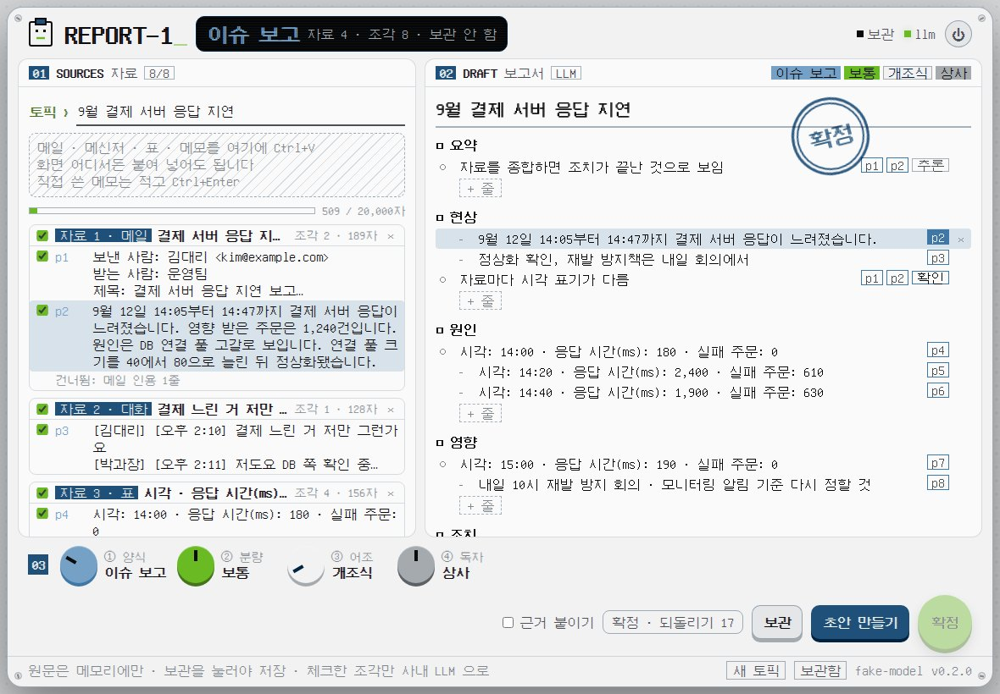
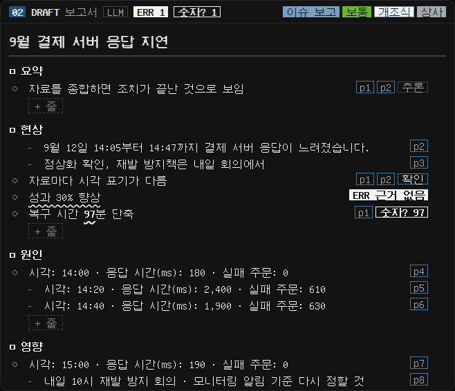

<p align="center">
  <picture>
    <source media="(prefers-color-scheme: dark)" srcset="docs/page/hero-dark.jpg">
    
  </picture>
</p>

<p align="center">
  <picture>
    <source media="(prefers-color-scheme: dark)" srcset="docs/page/title-dark.png">
    
  </picture>
</p>

<p align="center">
메일 스레드 셋, 메신저 캡처 글, 회의 메모, 엑셀 표 한 장. 이걸로 보고서를 써야 할 때를 위해 만들었습니다. 몇 가지만 꼽으면:<br>
순서 없이 그냥 붙여 넣으면, 사내 LLM 이 양식에 맞춰 두괄식으로 정리하고, 줄마다 근거 조각이 붙습니다.<br>
근거 없는 사실은 확정할 수 없습니다. 논리를 지어내는 노브는 없습니다.<br>
전부는 아니고, 이 정도입니다:
</p>

<p align="center"><sub>
파일 하나 · REPORT-1.PY · 표준 라이브러리만 · 파이썬 3.8+<br>
화면 어디서든 CTRL+V · 붙여 넣은 것 하나 = 자료 하나<br>
메일 · 대화 · 표 · 글을 알아봄 · 조각 P1 P2 … 로 나눔<br>
같은 조각 · 메일 인용(>) 줄은 건너뜀<br>
토픽 한 줄 · 양식 다섯 · 칸은 설정에서 더하기<br>
맨 위는 요약 · 결론부터<br>
줄마다 근거 칩 · 올리면 조각이 켜짐<br>
근거 없는 사실은 ERR · 확정 안 됨<br>
추론 · 확인(자료끼리 다름) · 빈칸(자료 없음) 표시<br>
조각에 없는 숫자는 물결 밑줄 · 숫자?<br>
고친 줄은 '직접' · 책임은 사람에게<br>
서버가 다시 판정 · 화면을 믿지 않음<br>
체크한 조각만 사내 LLM 으로 · 한도 계기판<br>
원문은 메모리에만 · 보관을 눌러야 저장<br>
LLM 이 없으면 기본 초안 · 자료를 그대로 묶기<br>
노브 네 개 · ①양식 ②분량 ③어조 ④독자 · ALT+1–4<br>
확정 · 도장 · 클립보드로 · 20초 되돌리기<br>
근거 붙이기 · [1] 표시와 근거 목록<br>
보관함 · 토픽 다시 열기 · 지난 보고서<br>
--DRAFT 파일… · 창 없이 글만<br>
127.0.0.1 전용 · 실행마다 새 토큰<br>
결재판 얼굴 · 붙여 넣으면 받아먹음<br>
다크 · 라이트 · 시스템 테마 · 빨강 없음<br>
설치는 OPENCODE 에게 · INSTALL.MD<br>
단위 · 통합 테스트 37 · 브라우저 E2E · WINDOWS + UBUNTU CI
</sub></p>

<p align="center"><a href="#install">설치하기 ›</a></p>

<br>

<h3 align="center">근거 없는 사실은, 없습니다.</h3>

<p align="center">
보고서의 줄마다 붙여 넣은 자료의 조각 id 가 붙습니다. <code>p3</code> 에 올리면 왼쪽의 그 조각이 켜집니다.<br>
LLM 이 근거 없이 적은 사실은 <code>ERR</code> — 확정 버튼이 꺼집니다. 근거 조각에 없는 숫자는 <code>숫자?</code> 와 물결 밑줄.<br>
조각을 이어 내린 판단은 <code>추론</code>, 자료끼리 다르면 <code>확인</code>, 양식에 필요한데 자료에 없으면 <code>빈칸</code>.<br>
사람이 고치면 <code>직접</code> 이 붙고 확정할 수 있습니다. 그 줄의 책임은 사람에게 있으니까요.
</p>

<p align="center"></p>
<p align="center"><sub>02 DRAFT · 근거 칩 · ERR 근거 없음 · 숫자? · 추론 · 확인 · 빈칸</sub></p>

<br>

<h3 align="center">그냥 붙여 넣으세요.</h3>

<p align="center">
메일은 제목을, 메신저는 첫 말을 제목으로 삼고, 엑셀 표는 줄마다 머리글을 붙여 조각으로 나눕니다.<br>
답장마다 되풀이되는 본문은 한 번만, 메일 인용(<code>&gt;</code>) 줄은 건너뜁니다. 무엇을 건너뛰었는지는 화면에 보입니다.<br>
사내 LLM 에는 <b>체크한 조각만</b> 보냅니다. 보내기 전에 화면에 다 보이고, 한도 계기판이 넘치면 보내지 않습니다.
</p>

<br>

<h3 align="center">원문은 메모리에만.</h3>

<p align="center">
붙여 넣은 원문은 디스크에 쓰지 않습니다. 며칠에 걸쳐 모을 때만 <b>보관</b>(Ctrl+S)을 누르세요 — 그때 이 PC 에만 저장됩니다.<br>
보관 안 한 자료가 있으면 창을 닫아도 저절로 꺼지지 않고 기다립니다. 다시 열면 그대로 있습니다.<br>
확정한 보고서는 복사한 글 그대로만 남습니다.
</p>

<br>

<h3 align="center">노브 네 개, 한 번 더.</h3>

<p align="center">
① 양식(현황 · 이슈 · 검토 · 회의 결과 · 자유 구성) ② 분량 ③ 어조(개조식 · 서술식) ④ 독자(팀 내부 · 상사 · 임원).<br>
노브 색은 works 인코더 색 그대로입니다. 초안 칸 위의 칩도, LCD 의 양식 이름도 같은 색 — 색이 곧 조작입니다.<br>
회사 양식이 따로 있으면 칸 이름만 설정에 넣으면 됩니다.
</p>

<br>

<h3 align="center">works 시스템.</h3>

<p align="center">
Report–1 은 works 시스템의 한 부품입니다.<br>
같은 팔레트, 같은 번호 라벨, 같은 노브 색으로 만든 사내 도구들.<br>
전부 받아서 바로 실행하고, 전부 내 PC 에서만 돕니다.
</p>

<p align="center"><a href="../README.md">explore ›</a></p>

<br>

<a name="specs"></a>
<h3 align="center">사양.</h3>

<table align="center">
<tr><td width="140">실행</td><td width="560">Windows 10 / 11 · Python 3.8+</td></tr>
<tr><td>의존성</td><td>없음 — 표준 라이브러리만</td></tr>
<tr><td>배포</td><td><code>report-1.py</code> 한 파일 · UI 와 폰트 내장</td></tr>
<tr><td>자료</td><td>붙여 넣은 글 (메일 · 대화 · 표 · 글 · 메모) · 한 번에 100,000자 · 토픽 하나에 400,000자</td></tr>
<tr><td>LLM</td><td>OpenAI 호환 <code>/v1/chat/completions</code> · <a href="../docs/SPEC-llm.md">works LLM 규격</a> · 없으면 기본 초안</td></tr>
<tr><td>저장</td><td><code>%LOCALAPPDATA%\report-1\</code> — <code>config.json</code> · <code>topics\</code>(보관할 때만) · <code>reports\</code>(확정한 글) — 원문 · 초안은 메모리에만</td></tr>
<tr><td>네트워크</td><td><code>127.0.0.1</code> 전용 · 실행마다 새 토큰 · 밖으로는 설정한 LLM 주소 하나</td></tr>
<tr><td>키</td><td><code>Ctrl+V</code> 붙여 넣기 · <code>Ctrl+Enter</code> 초안 · <code>Ctrl+S</code> 보관 · <code>Ctrl+Shift+Enter</code> 확정 · <code>Ctrl+Z</code> 되돌리기 · <code>Alt+1–4</code> 노브</td></tr>
<tr><td>글꼴</td><td>GNU Unifont 15.1.01 부분집합 · SIL OFL 1.1 (<a href="fonts/OFL.txt">fonts/OFL.txt</a>)</td></tr>
<tr><td>테스트</td><td>단위 · 통합 37 · 브라우저 E2E · CI Windows + Ubuntu × Python 3.8 · 3.13</td></tr>
</table>

<br>

<a name="install"></a>
<h3 align="center">설치.</h3>

<p align="center">OpenCode 에 아래를 붙여넣으면 <a href="INSTALL.md">INSTALL.md</a> 순서대로 설치합니다. LLM 설정은 OpenCode 설정에서 가져오고, 키는 어디에도 찍히지 않습니다.</p>

```text
Report–1 을 설치해줘. works 저장소를 D:\OPENCODE 에 받고, 프로그램 폴더는 D:\OPENCODE\report-1 이야.
1. 코드 받기: D:\OPENCODE 가 없거나 비어 있으면 git clone https://github.com/leebobegogigug-blip/Works.git "D:\OPENCODE"
   (이미 works 가 받아져 있으면 받지 말고, git 이 안 되면 Works-repo.zip 을 D:\OPENCODE 에 풀어)
2. 그다음 D:\OPENCODE\report-1\INSTALL.md 를 끝까지 읽고 그 순서대로만 진행해.
   API 키·토큰은 절대 출력하지 말고, [질문] 표시가 있는 곳에서는 나한테 물어봐.
```

<br>

<h3 align="center">설치비 0원 · 의존성 0개<br>반품은 한 줄이면 끝*</h3>

<p align="center"><sub>*<code>--shortcut off</code> 로 시작 메뉴 바로가기를 지우면 PC 에 남는 건 <code>%LOCALAPPDATA%\report-1</code> 뿐 — 자세한 순서는 <a href="INSTALL.md#제거">INSTALL.md › 제거</a></sub></p>

<br>

<table align="center">
<tr><td width="620"><a href="INSTALL.md">설치 가이드</a> <sub>· OpenCode 에이전트용 단계별 절차 · 업데이트 · 제거</sub></td><td align="right" width="40">›</td></tr>
<tr><td><a href="docs/MANUAL.md">매뉴얼</a> <sub>· 설정 · 쓰는 법 · 근거 규칙 · 화면</sub></td><td align="right">›</td></tr>
<tr><td><a href="../docs/DESIGN.md">디자인</a> <sub>· works 공통 원칙 일곱 가지 · 팔레트</sub></td><td align="right">›</td></tr>
<tr><td><a href="https://github.com/leebobegogigug-blip/Works/issues">문제 알리기</a> <sub>· 이슈</sub></td><td align="right">›</td></tr>
<tr><td><a href="../README.md">works</a> <sub>· 시스템 전체 · 다른 부품</sub></td><td align="right">›</td></tr>
</table>

<br>

<p align="center">
  <picture>
    <source media="(prefers-color-scheme: dark)" srcset="../docs/page/colophon-dark.png">
    
  </picture>
</p>

<p align="center"><sub>
Report–1 · 정리는 해 드립니다. 판단은 직접 하셔야 합니다.<br>
내장 폰트 GNU Unifont 15.1.01 부분집합 · SIL OFL 1.1 (<a href="fonts/OFL.txt">fonts/OFL.txt</a>)<br>
화면 문법은 소형 하드웨어 계측기(Teenage Engineering 류)에서 영감을 받았고, 해당 회사와는 관련이 없습니다.
</sub></p>
