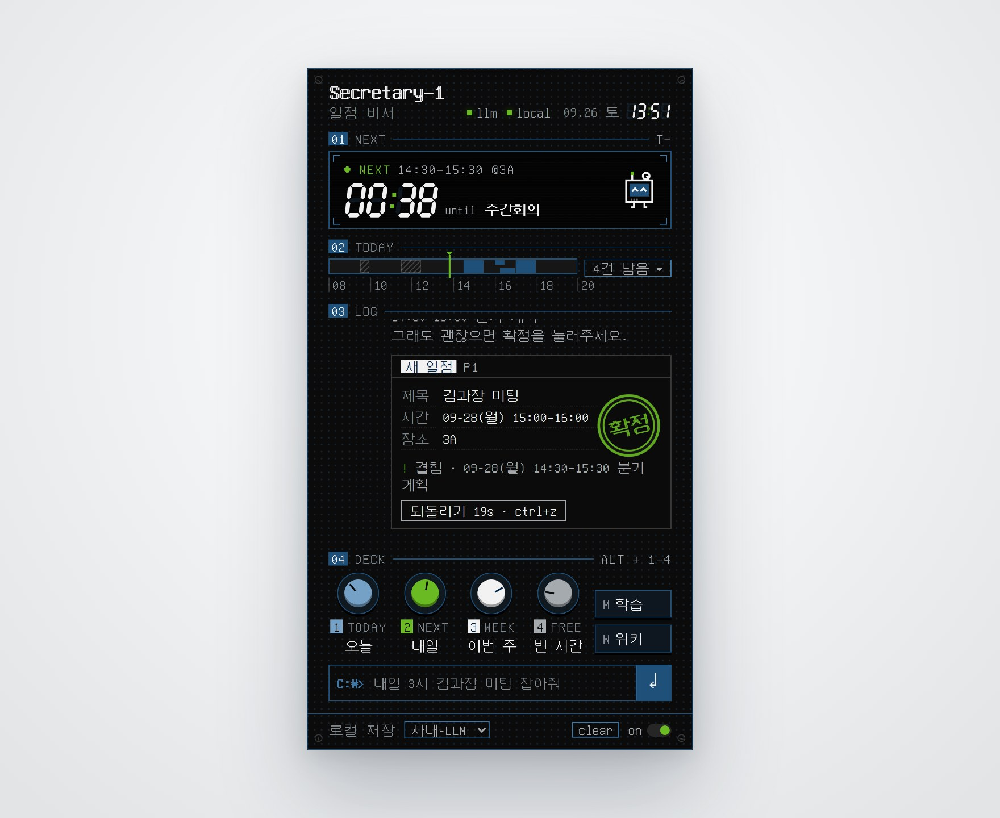
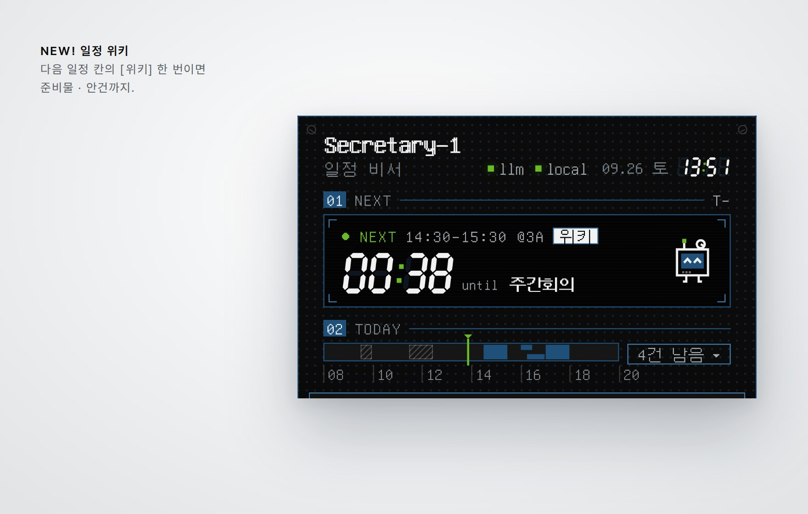
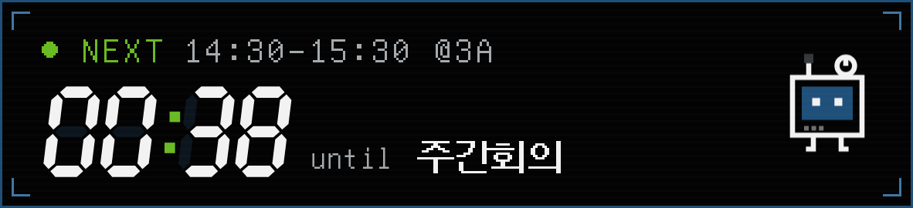
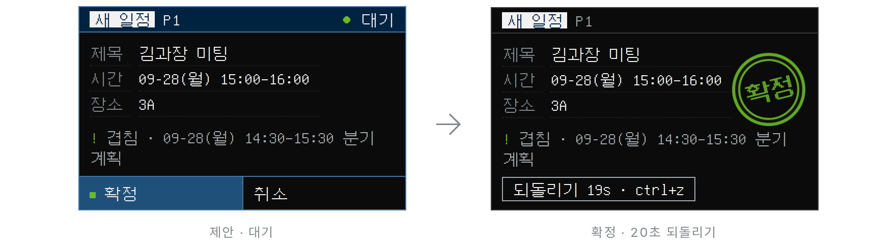
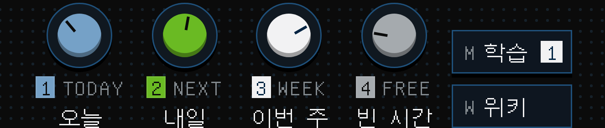
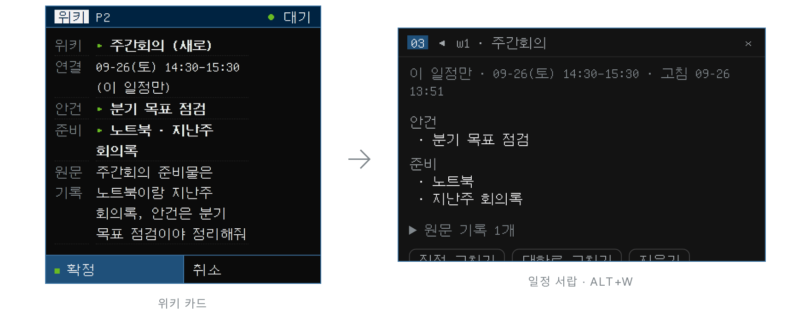
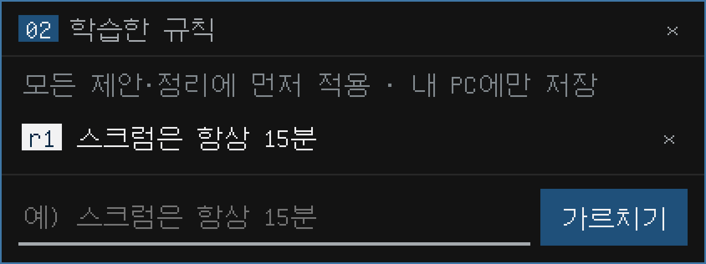
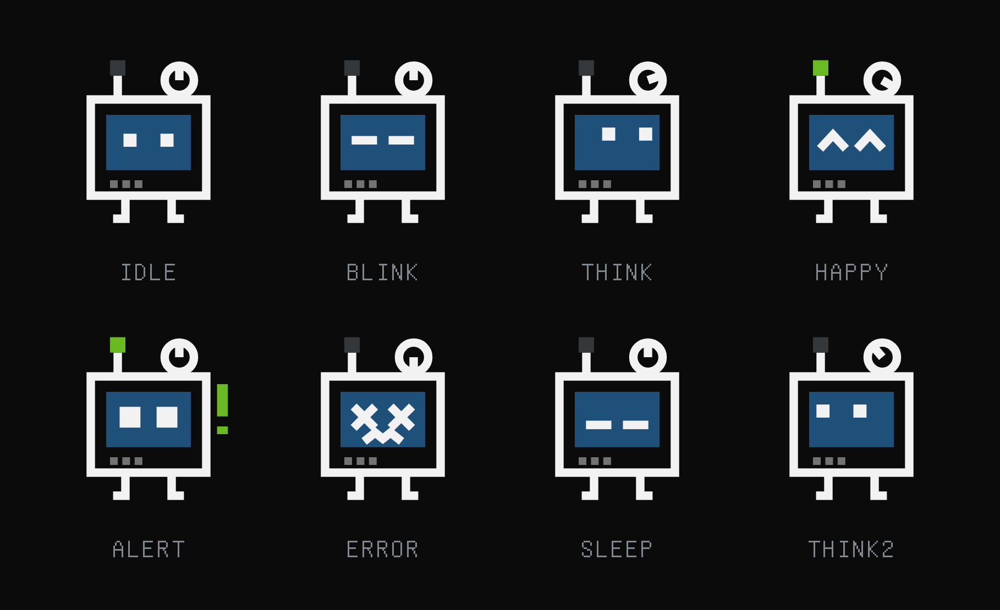
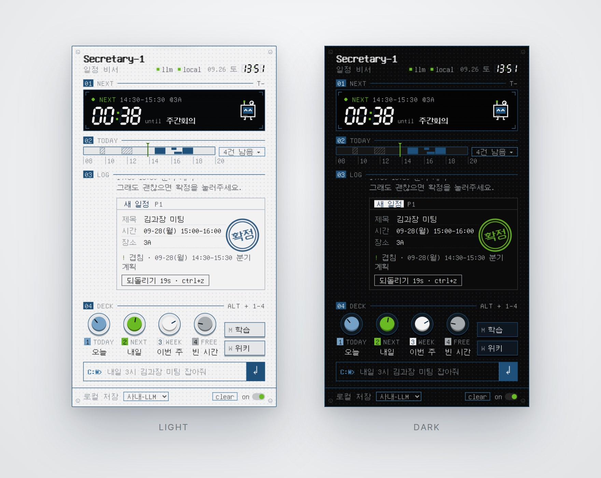

<p align="center">
  <picture>
    <source media="(prefers-color-scheme: dark)" srcset="docs/page/hero-dark.jpg">
    
  </picture>
</p>

<p align="center">
  <picture>
    <source media="(prefers-color-scheme: dark)" srcset="docs/page/title-dark.png">
    
  </picture>
</p>

<p align="center">
텍스트로 말을 걸면 일정을 조회하고, 제안하고, 정리합니다. 몇 가지만 꼽으면:<br>
확정 버튼을 눌러야만 바뀌는 캘린더, 20초 되돌리기, 회의마다 붙는 위키,<br>
한 번 가르치면 계속 가는 학습 규칙, 노브 네 개, 그리고 표정이 바뀌는 얼굴.<br>
파일 하나, 표준 라이브러리만. 사내 LLM 이야기를 했던가요? 그것도 됩니다.<br>
전부는 아니고, 이 정도입니다:
</p>

<p align="center"><sub>
파일 하나 · SECRETARY-1.PY · 약 450 KB<br>
파이썬 3.8+ · 표준 라이브러리만<br>
제안 → 확정 2단계 · 확정 전엔 캘린더를 건드리지 않음<br>
확정 CTRL+ENTER · ㅇㅇ · 취소 ESC · ㄴㄴ<br>
확정 뒤 20초 되돌리기 · CTRL+Z<br>
겹치는 일정은 카드에 먼저<br>
빈 시간 찾기 · 업무시간 · 요일 기준<br>
다음 일정 7세그먼트 카운트다운<br>
회의 중이면 끝날 때까지 남은 시간<br>
알림 시각이 되면 숫자가 깜빡<br>
오늘 한 줄 트랙 · 지난 일정은 빗금<br>
오늘 일정 서랍 · ALT+D<br>
노브 네 개 · ALT+1–4<br>
학습 서랍 ALT+M · 일정 위키 ALT+W<br>
로컬 학습 규칙 · SECRETARY-1-RULES.JSON<br>
명령어 /학습 · /잊어 · /규칙 · /위키 · /알림 · /도움<br>
일정 위키 · 목적 · 안건 · 준비 · 참석자 · 결정 · 메모 · 링크<br>
반복 회의는 위키 한 장으로<br>
위키는 서랍에서 직접 고치기<br>
위키 원문 기록은 카드에 미리 보임<br>
"준비물 뭐였지?" 에 위키로 답하기<br>
윈도우 알림 · 장소 있으면 15 · 5 · 1분 전 · 없으면 5 · 1분 전<br>
알림에 준비물을 같이<br>
OUTLOOK 클래식 연동 · 또는 로컬 SQLITE<br>
OPENAI 호환 API · 도구 호출 NATIVE / JSON 자동 전환<br>
모델 드롭다운 · /V1/MODELS<br>
OPENCODE 설정에서 LLM 값 가져오기 · --SETUP<br>
키는 {ENV:…} · {FILE:…} 참조<br>
프록시 · 사내 인증서 PEM<br>
설정 바꾸기 · --SET 키=값<br>
전역 단축키 · CTRL+ALT+J<br>
로그인할 때 자동 실행 · --AUTOSTART ON<br>
--STATUS · --STOP · --CHECK<br>
127.0.0.1 전용 · 실행마다 새 토큰<br>
대화는 메모리에만<br>
도스 픽셀 폰트 내장 · 한글 11,172자<br>
표정 8가지 · 네모 화면 얼굴<br>
다크 · 라이트 · 시스템 테마<br>
빨강 없는 팔레트 · 네이비 · 라임 · 회색<br>
설치는 OPENCODE 에게 · INSTALL.MD<br>
가짜 LLM 서버로 도는 브라우저 E2E<br>
공개 명령 · 일정 JSON · --EXPORT-EVENTS<br>
단위 테스트 123 · WINDOWS + UBUNTU CI
</sub></p>

<p align="center"><a href="#install">설치하기 ›</a></p>

<br>

<p align="center">
  <picture>
    <source media="(prefers-color-scheme: dark)" srcset="docs/page/detail-dark.jpg">
    
  </picture>
</p>

<br>

<h3 align="center">다음 일정만, 크게.</h3>

<p align="center">
시계는 이미 작업 표시줄에 있으니까요.<br>
Secretary–1 의 화면은 다음 일정까지 남은 시간만 7세그먼트로 크게 보여 줍니다.<br>
회의 중이면 끝날 때까지 남은 시간을, 알림 시각이 되면 숫자를 깜빡입니다.<br>
오른쪽의 얼굴은 그때그때 표정이 바뀝니다.
</p>

<p align="center"></p>
<p align="center"><sub>01 NEXT · 남은 시간 · 진행 중이면 끝날 때까지 · 장소 · 위키 버튼 · 얼굴</sub></p>

<br>

<h3 align="center">확정 전엔, 아무 일도 없습니다.</h3>

<p align="center">
만들기 · 바꾸기 · 지우기는 영수증 같은 카드로 먼저 나옵니다. 겹치는 일정이 있으면 카드에 적혀 있습니다.<br>
확정(Ctrl+Enter · ㅇㅇ)을 누르면 도장이 찍히고, 20초 안에는 Ctrl+Z 로 되돌릴 수 있습니다.<br>
그 사이 Outlook 에서 누가 고쳤다면, 되돌리지 않고 알려 줍니다.
</p>

<p align="center">
  <picture>
    <source media="(prefers-color-scheme: dark)" srcset="docs/page/cards-dark.png">
    
  </picture>
</p>
<p align="center"><sub>PROPOSAL CARD · 새 일정 · 바꾸기 · 지우기 · 학습 · 위키 — 전부 카드부터</sub></p>

<br>

<h3 align="center">노브 네 개면 충분합니다.</h3>

<p align="center">
제일 자주 묻는 네 가지를 노브에 달았습니다. Alt+1 부터 Alt+4.<br>
노브 색은 Terminal–1 인코더와 같은 순서입니다. ①파랑 ②라임 ③흰색 ④회색.<br>
번호표도 그 색으로 칠해 두었습니다. 색이 곧 조작입니다.
</p>

<p align="center"></p>
<p align="center"><sub>04 DECK · ① 오늘 · ② 내일 · ③ 이번 주 · ④ 빈 시간 · M 학습 · W 위키</sub></p>

<br>

<h3 align="center">회의 전에, 위키부터.</h3>

<p align="center">
"주간회의 준비물은 노트북이랑 지난주 회의록" 이라고 말하면 위키 카드로 정리해 둡니다.<br>
반복 회의는 같은 제목의 모든 회차에 붙고, 알림에는 준비물이 같이 뜹니다.<br>
"이따 회의 준비물 뭐였지?" 라고 물어도 되고, 서랍에서 직접 고쳐도 됩니다.
</p>

<p align="center">
  <picture>
    <source media="(prefers-color-scheme: dark)" srcset="docs/page/wiki-dark.png">
    
  </picture>
</p>
<p align="center"><sub>SCHEDULE WIKI · 목적 · 안건 · 준비 · 참석자 · 결정 · 메모 · 링크</sub></p>

<br>

<h3 align="center">한 번 가르치면, 계속.</h3>

<p align="center">
"앞으로 스크럼은 15분으로 잡아." 학습 카드를 확정하면 그다음부터 모든 제안과 정리에 먼저 적용합니다.<br>
<code>/학습</code> 으로 바로 넣고, <code>/잊어 r3</code> 로 뺍니다.
</p>

<p align="center"></p>
<p align="center"><sub>02 학습한 규칙 · 모든 제안 · 정리에 먼저 적용 · 내 PC 의 SECRETARY-1-RULES.JSON 에만</sub></p>

<p align="center"><a href="#install">설치하기 ›</a></p>

<br>

<h3 align="center">기분이 얼굴에 다 보입니다.</h3>

<p align="center">
네모난 화면 얼굴, 노브 하나, 안테나 불빛 하나.<br>
생각할 땐 노브를 돌리고, 확정하면 웃고, 일정이 다가오면 안테나에 불이 켜집니다.<br>
오늘 일정이 다 끝나면 잡니다. 부럽게도.
</p>

<p align="center"></p>
<p align="center"><sub>FACE · IDLE · BLINK · THINK · HAPPY · ALERT · ERROR · SLEEP</sub></p>

<br>

<h3 align="center">검정이든 회색이든, 네이비와 라임.</h3>

<p align="center">
색은 세 가지뿐입니다. 네이비는 뼈대와 버튼, 라임은 '지금'과 '켜짐', 회색은 글자.<br>
빨강은 없습니다. 경고는 가장 밝은 글자색과 <code>ERR</code> 칩으로 합니다.
</p>

<p align="center">
  <picture>
    <source media="(prefers-color-scheme: dark)" srcset="docs/page/colors-dark.jpg">
    
  </picture>
</p>
<p align="center"><sub>THEME · DARK (기본) · LIGHT · SYSTEM</sub></p>

<p align="center">
  <picture>
    <source media="(prefers-color-scheme: dark)" srcset="../docs/page/palette-dark.png">
    
  </picture>
</p>
<p align="center"><sub>PALETTE · works 공통 · <a href="../docs/DESIGN.md">DESIGN.md</a></sub></p>

<br>

<h3 align="center">works 시스템.</h3>

<p align="center">
Secretary–1 은 works 시스템의 한 부품입니다.<br>
같은 팔레트, 같은 번호 라벨, 같은 노브 색으로 만든 사내 도구들.<br>
전부 받아서 바로 실행하고, 전부 내 PC 에서만 돕니다.
</p>

<p align="center"><a href="../README.md">explore ›</a></p>

<p align="center">
  <picture>
    <source media="(prefers-color-scheme: dark)" srcset="../docs/page/system-dark.jpg">
    
  </picture>
</p>

<br>

<p align="center">
  <picture>
    <source media="(prefers-color-scheme: dark)" srcset="docs/page/certified-dark.png">
    
  </picture>
</p>

<p align="center">
알림은 Secretary–1 이 켜져 있을 때만 옵니다.<br>
로그인할 때 저절로 켜지게 해 두면(<code>--autostart on</code>), 월요일 아침 9시 스크럼도 놓치지 않습니다.<br>
커피는 직접 타셔야 합니다.
</p>

<br>

<p align="center"><sub>EXPLORE WORKS SYSTEM COMPONENTS:</sub></p>

<p align="center">
  <picture>
    <source media="(prefers-color-scheme: dark)" srcset="../docs/page/parts-dark.jpg">
    
  </picture>
</p>

<p align="center">
<a href="#specs">Secretary–1 ›</a> &nbsp;·&nbsp;
<a href="../README.md">works 의 다른 부품 ›</a>
</p>

<br>

<a name="specs"></a>
<h3 align="center">사양.</h3>

<table align="center">
<tr><td width="140">실행</td><td width="560">Windows 10 / 11 · Python 3.8+</td></tr>
<tr><td>의존성</td><td>없음 (Outlook 연동 때만 <code>pywin32</code>)</td></tr>
<tr><td>배포</td><td><code>secretary-1.py</code> 한 파일 · UI 와 폰트 내장 · 약 450 KB</td></tr>
<tr><td>LLM</td><td>OpenAI 호환 <code>/v1/chat/completions</code> · 도구 호출 native / json 자동 전환 · 모델 드롭다운</td></tr>
<tr><td>캘린더</td><td>local (SQLite <code>secretary-1.db</code>) · outlook (클래식 Outlook)</td></tr>
<tr><td>저장</td><td><code>config.json</code> · <code>secretary-1.db</code> · <code>secretary-1-rules.json</code> · <code>secretary-1-wiki.json</code> — 전부 이 PC</td></tr>
<tr><td>네트워크</td><td><code>127.0.0.1</code> 전용 · 실행마다 새 토큰 · 밖으로는 설정한 LLM 주소 하나</td></tr>
<tr><td>알림</td><td>윈도우 토스트 · 장소 있으면 15 · 5 · 1분 전, 없으면 5 · 1분 전</td></tr>
<tr><td>키</td><td><code>Ctrl+Alt+J</code> 전역 · <code>Alt+1–4</code> · <code>Alt+D</code> · <code>Alt+M</code> · <code>Alt+W</code> · <code>Ctrl+Z</code></td></tr>
<tr><td>테마</td><td>dark (기본) · light · system — 둘 다 네이비 주색 · 라임 강조</td></tr>
<tr><td>글꼴</td><td>Secretary1DOS — GNU Unifont 15.1.01 부분집합 · SIL OFL 1.1</td></tr>
<tr><td>테스트</td><td>단위 · 통합 123 · 브라우저 E2E (가짜 LLM) · CI Windows + Ubuntu × Python 3.8 · 3.13</td></tr>
</table>

<br>

<a name="install"></a>
<h3 align="center">설치.</h3>

<p align="center">OpenCode 에 아래를 붙여넣으면 <a href="INSTALL.md">INSTALL.md</a> 순서대로 <code>D:\OPENCODE\secretary-1</code> 에 설치합니다.<br>Terminal–1 과 같은 works 저장소를 씁니다. LLM 설정은 OpenCode 설정에서 그대로 가져오고, 키는 어디에도 찍히지 않습니다.</p>

```text
Secretary–1 을 설치해줘. works 저장소를 D:\OPENCODE 에 받고, 프로그램 폴더는 D:\OPENCODE\secretary-1 이야.
1. 코드 받기: D:\OPENCODE 가 없거나 비어 있으면 git clone https://github.com/leebobegogigug-blip/Works.git "D:\OPENCODE"
   (이미 works 가 받아져 있으면 받지 말고, git 이 안 되면 Works-repo.zip 을 D:\OPENCODE 에 풀어)
2. 그다음 D:\OPENCODE\secretary-1\INSTALL.md 를 끝까지 읽고 그 순서대로만 진행해.
   API 키·토큰은 절대 출력하지 말고, [질문] 표시가 있는 곳에서는 나한테 물어봐.
```

<p align="center">직접 설치할 때 (Windows · Python 3.8+)</p>

```bat
git clone https://github.com/leebobegogigug-blip/Works.git "D:\OPENCODE"
cd /d D:\OPENCODE\secretary-1
python secretary-1.py --setup           :: OpenCode 설정에서 LLM 값 가져오기 + 점검 (config.json · secretary-1.bat 생성)
python secretary-1.py --test-notify     :: 윈도우 알림이 뜨는지 확인
python secretary-1.py --autostart on    :: (선택) 로그인할 때 자동 실행
```

<p align="center">그다음부터는 <code>secretary-1.bat</code> 더블클릭, 또는 어디서든 <b>Ctrl+Alt+J</b>.</p>

<br>

<h3 align="center">설치비 0원 · 의존성 0개*<br>반품은 두 줄이면 끝*</h3>

<p align="center"><sub>*Outlook 연동 때만 <code>pywin32</code>. <code>--stop</code> · <code>--autostart off</code> 두 줄이면 조용해지고, 일정 · 설정 파일 정리는 <a href="INSTALL.md#제거">INSTALL.md › 제거</a></sub></p>

<br>

<table align="center">
<tr><td width="620"><a href="INSTALL.md">설치 가이드</a> <sub>· OpenCode 에이전트용 단계별 절차 · 문제 해결</sub></td><td align="right" width="40">›</td></tr>
<tr><td><a href="docs/MANUAL.md">매뉴얼</a> <sub>· 설정 · 쓰는 법 · 명령어 · 화면</sub></td><td align="right">›</td></tr>
<tr><td><a href="../docs/DESIGN.md">디자인</a> <sub>· works 공통 원칙 일곱 가지 · 팔레트</sub></td><td align="right">›</td></tr>
<tr><td><a href="docs/MANUAL.md#개발">개발</a> <sub>· build.py · 테스트 · 브라우저 E2E</sub></td><td align="right">›</td></tr>
<tr><td><a href="docs/MANUAL.md#알려진-한계">알려진 한계</a></td><td align="right">›</td></tr>
<tr><td><a href="https://github.com/leebobegogigug-blip/Works/issues">문제 알리기</a> <sub>· 이슈</sub></td><td align="right">›</td></tr>
<tr><td><a href="../README.md">works</a> <sub>· 시스템 전체 · 다른 부품</sub></td><td align="right">›</td></tr>
</table>

<br>

<p align="center">
  <picture>
    <source media="(prefers-color-scheme: dark)" srcset="../docs/page/colophon-dark.png">
    
  </picture>
</p>

<p align="center"><sub>
Secretary–1 · 내 PC 에서만 삽니다. 비서실장은 아닙니다. 결재는 직접 하셔야 합니다. 일정은 잡아 드립니다.<br>
내장 폰트 GNU Unifont 15.1.01 부분집합 · SIL OFL 1.1 (<a href="fonts/OFL.txt">fonts/OFL.txt</a>)<br>
화면 문법은 소형 하드웨어 계측기(Teenage Engineering 류)에서 영감을 받았고, 해당 회사와는 관련이 없습니다.
</sub></p>
