<p align="center">
  <picture>
    <source media="(prefers-color-scheme: dark)" srcset="docs/images/page/hero-dark.jpg">
    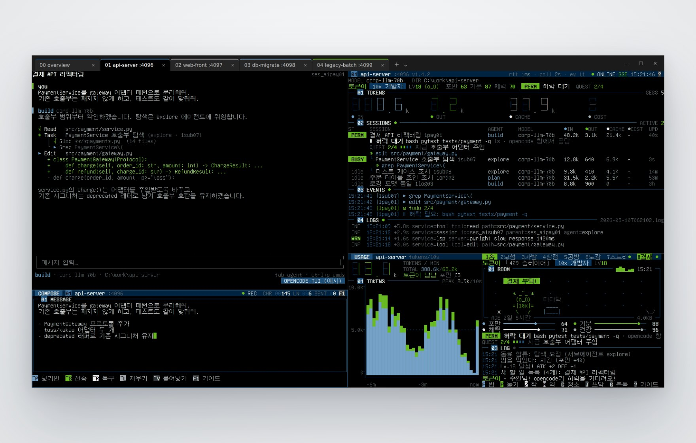
  </picture>
</p>

<p align="center">
  <picture>
    <source media="(prefers-color-scheme: dark)" srcset="docs/images/page/title-dark.png">
    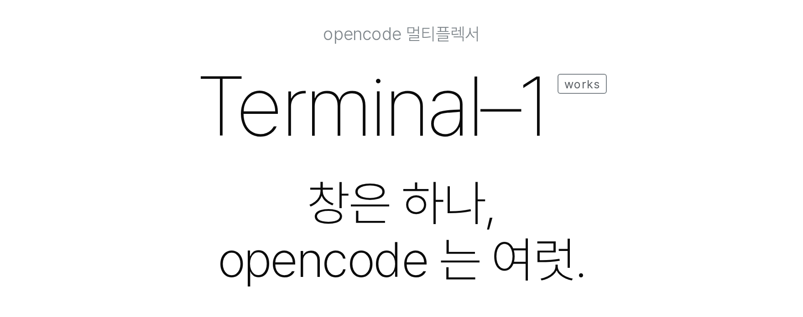
  </picture>
</p>

<p align="center">
opencode 를 프로젝트마다 하나씩 띄우면, 창을 오가느라 하루가 갑니다. 몇 가지만 꼽으면:<br>
채널 하나에 탭 하나, 서브에이전트까지 보이는 세션 트리, 깜빡이는 허락 대기 칩,<br>
붙여넣기가 새지 않는 입력창, 세그먼트로 세는 토큰, 그리고 모든 채널을 한눈에 보는 00 번 탭.<br>
펫 이야기를 했던가요? 토큰을 먹고 자랍니다.<br>
전부는 아니고, 이 정도입니다:
</p>

<p align="center"><sub>
채널 = 탭 · TERMINAL-1 ADD 한 번<br>
채널마다 다섯 칸 · OPENCODE · STATUS · COMPOSE · USAGE · TOKEN QUEST<br>
채널 번호는 한 번 정해지면 바뀌지 않음<br>
4096 번부터 빈 포트<br>
00 OVERVIEW · 모든 채널을 한 화면에<br>
세션 트리 · 서브에이전트 · 지금 도는 도구<br>
OPENCODE 할 일 진행 · QUEST 2/4<br>
허락 · 질문 대기면 PERM · ASK 칩이 깜빡 · 몇 초째인지 셈<br>
토큰 네 값 · ①IN ②OUT ③CACHE ④COST<br>
분당 토큰 세그먼트 숫자 · 10초 막대 차트<br>
토큰이 흐르는 동안 도는 테이프 릴<br>
채널별 믹서<br>
붙여넣기 글자 누락을 막는 큰 입력창<br>
마지막으로 보낸 글 복구 · CTRL+R<br>
모든 칸에 ? 가이드 · COMPOSE 는 F1<br>
TERMINAL-1 LS · 채널 표 + 상태 LED<br>
TERMINAL-1 FOCUS · 닫은 채널을 같은 포트로<br>
TERMINAL-1 RM · TERMINAL-1 PRUNE<br>
HEADLESS 서버 모드 · 탭을 닫아도 서버는 유지<br>
같은 서버 조회는 한 칸만 · 나머지는 결과를 나눠 읽음<br>
비밀번호는 명령줄 대신 파일로<br>
COMPOSE 로 보낸 글은 디스크에 남기지 않음<br>
레이아웃 비율 · -RIGHTWIDTH · -BOTTOMHEIGHT · -GAMEWIDTH · -COMPOSEHEIGHT<br>
-NOPET · -COMPACT · -NOLOGS · -NOCOMPOSE<br>
TERMINAL-1 BLACK 색 테마<br>
GNU UNIFONT 15.1.01 추천 · 폭 1칸 아이콘만<br>
한 장 찍기 · --ONCE · --GUIDE<br>
PYTHON 3.8+ · 표준 라이브러리만 · PIP INSTALL 없음<br>
TOKEN QUEST · 채널마다 펫 한 마리 · -PETNAME<br>
알 → 비트 → 바이트 → 청소년 → 성체 → 전설<br>
성격 7종 · 키운 방식이 진화를 정함<br>
서브에이전트는 동료로 합류<br>
429 레이트 리밋이면 429 드래곤<br>
12지역 × 10층 · 몬스터 78종 · 챕터 보스 12<br>
주간 레이드 · 모든 채널이 보스 하나를 함께 · 하루 3번<br>
미니게임 네 가지 · 장비 +10 강화 · 방 꾸미기<br>
메인 스토리 12챕터 · 매주 한 장 · 커밋 조각 12개<br>
은퇴 · 명예의 전당 · 다음 세대<br>
테스트 125 · WINDOWS + UBUNTU CI
</sub></p>

<p align="center"><a href="#install">설치하기 ›</a></p>

<br>

<p align="center">
  <picture>
    <source media="(prefers-color-scheme: dark)" srcset="docs/images/page/detail-dark.jpg">
    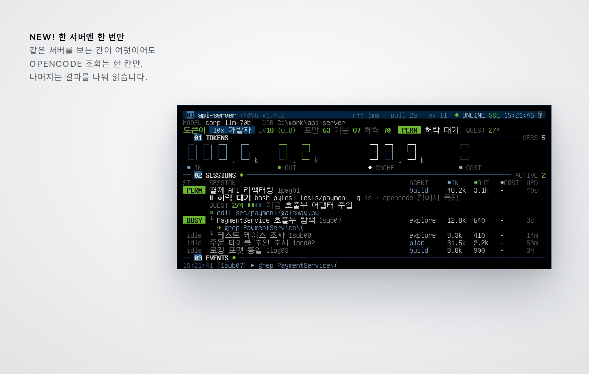
  </picture>
</p>

<br>

<h3 align="center">누가 일하고, 누가 기다리는지.</h3>

<p align="center">
세션 트리에 서브에이전트까지, 지금 도는 도구와 할 일 진행이 한 줄씩.<br>
opencode 가 허락이나 질문에서 멈추면 PERM · ASK 칩이 깜빡이고, 몇 초째 기다리는지 셉니다.<br>
위쪽 네 숫자는 ①IN ②OUT ③CACHE ④COST. 색이 곧 순서입니다.
</p>

<p align="center">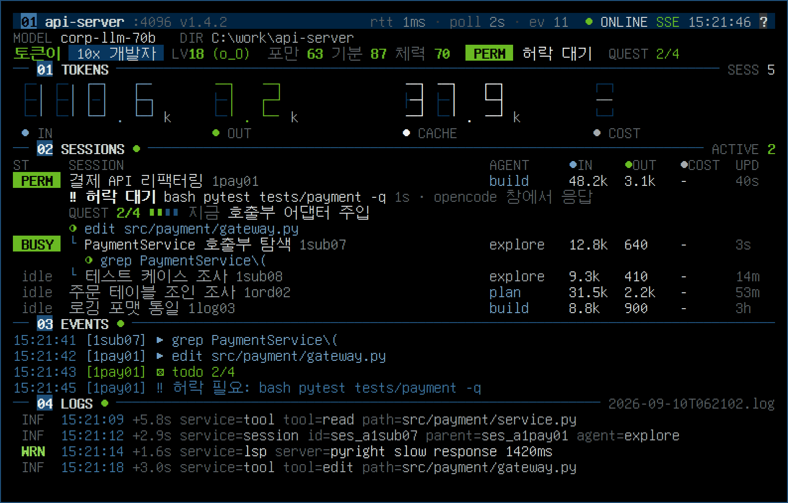</p>
<p align="center"><sub>② STATUS · 01 TOKENS · 02 SESSIONS · 03 EVENTS · 04 LOGS</sub></p>

<br>

<h3 align="center">긴 글은 여기서.</h3>

<p align="center">
긴 지시는 아래 칸의 큰 입력 상자에서 쓰고 opencode 로 보냅니다.<br>
붙여넣다 특수문자가 빠지면 클립보드를 직접 넣고, 마지막으로 보낸 글은 Ctrl+R 로 되살립니다.<br>
조작 키를 누르면 그 키의 색으로 상자 테두리가 켜집니다.
</p>

<p align="center">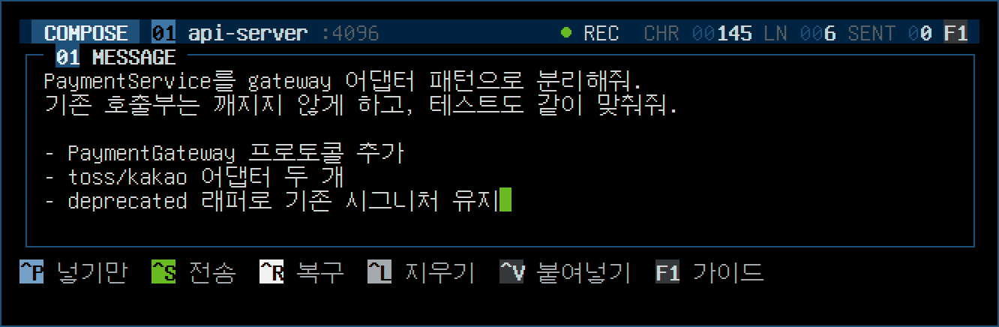</p>
<p align="center"><sub>③ COMPOSE · ^P 넣기만 · ^S 전송 · ^R 복구 · ^L 지우기</sub></p>

<br>

<h3 align="center">토큰은 세그먼트로 셉니다.</h3>

<p align="center">
분당 토큰은 세그먼트 숫자로, 흐름은 10초 막대로.<br>
토큰이 흐르는 동안에는 위쪽 테이프 릴이 돌아갑니다.
</p>

<p align="center">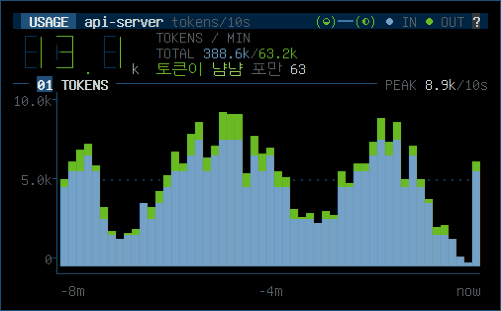</p>
<p align="center"><sub>④ USAGE · 분당 토큰 · 10초 막대 · ①IN 파랑 · ②OUT 라임</sub></p>

<br>

<h3 align="center">00 번 탭에서, 전부.</h3>

<p align="center">
채널이 몇 개든 00 번 탭 하나로 봅니다.<br>
채널마다 한 줄, 지금 일하는 세션 전부, WARN 이상 로그, 채널별 믹서, 그리고 펫 목장까지.
</p>

<p align="center">
  <picture>
    <source media="(prefers-color-scheme: dark)" srcset="docs/images/page/overview-dark.jpg">
    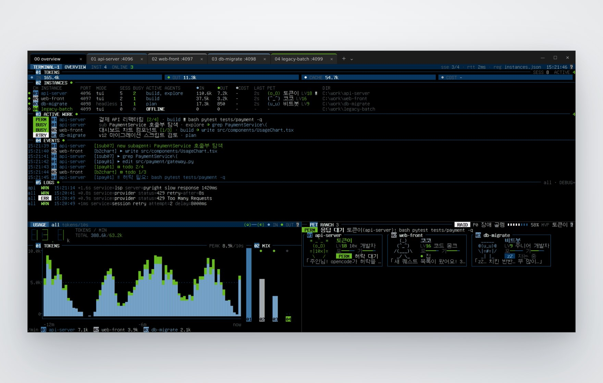
  </picture>
</p>
<p align="center"><sub>00 OVERVIEW · 01 TOKENS · 02 INSTANCES · 03 ACTIVE WORK · 04 EVENTS · 05 LOGS · MIX · RANCH</sub></p>

<br>

<h3 align="center">화면이 스스로 설명합니다.</h3>

<p align="center">
어느 칸에서든 <code>?</code>(compose 는 <code>F1</code>)를 누르면 구역마다 번호표가 붙고, 아래 띠에 이름과 설명이 나옵니다.<br>
<code>1</code>–<code>9</code> 나 <code>←</code> <code>→</code> 로 고르고, 다른 키를 누르면 닫힙니다. 매뉴얼을 따로 펼칠 일이 없습니다.
</p>

<p align="center">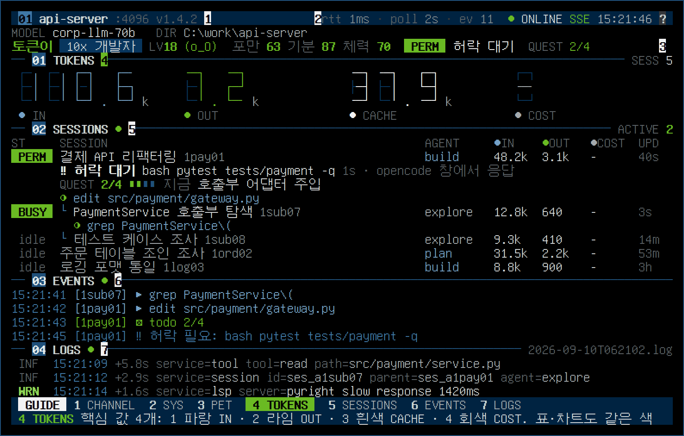</p>
<p align="center"><sub>? GUIDE · 번호표 + 이름 띠 + 고른 번호 설명</sub></p>

<p align="center"><a href="#install">설치하기 ›</a></p>

<br>

<h3 align="center">토큰을 먹고 자랍니다.</h3>

<p align="center">
채널마다 펫 한 마리. 토큰은 밥이자 경험치, AI 가 일하는 동안에는 노트북을 두드리거나 던전에 갑니다.<br>
opencode 의 할 일은 메인 퀘스트, 허락 대기는 "결재 부탁!" 팻말.<br>
매주 모든 채널의 펫이 보스 하나를 함께 때립니다. 키운 방식이 진화를 정합니다.
</p>

<p align="center">
  <picture>
    <source media="(prefers-color-scheme: dark)" srcset="docs/images/page/pet-dark.png">
    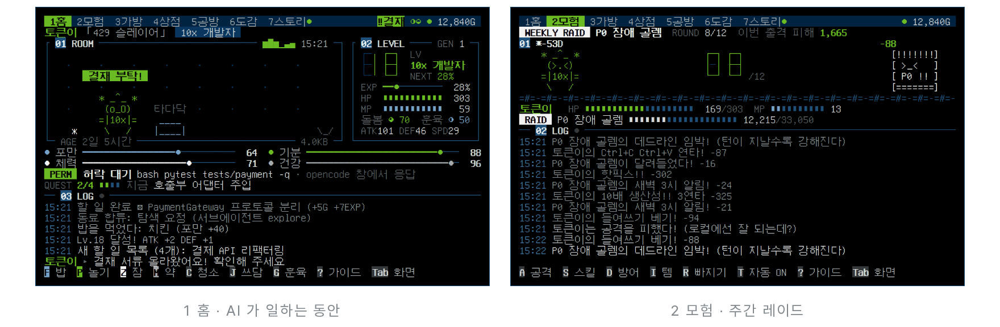
  </picture>
</p>
<p align="center"><sub>⑤ TOKEN QUEST · TQ–1 · 다마고치 × RPG · 80×24 터미널 한 칸</sub></p>

<br>

<h3 align="center">어느 월요일 아침, 모든 빌드가 빨개졌다.</h3>

<p align="center">
하루 종일 켜 두는 화면이니, 몇 주 동안 따라갈 이야기를 넣었습니다.<br>
챕터는 매주 한 장씩 열리고, 평소처럼 opencode 를 쓰면 미션이 채워집니다.<br>
첫 조각은 로컬호스트 평원에 있다고 합니다. …로컬에선 늘 잘 됐으니까.
</p>

<p align="center">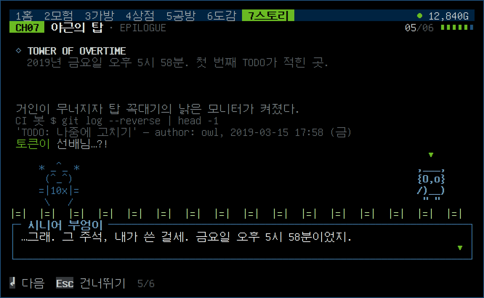</p>
<p align="center"><sub>S1 메인 스토리 · 초록불을 찾아서 · 12챕터 · 매주 한 장</sub></p>

<br>

<h3 align="center">색은 세 가지뿐.</h3>

<p align="center">
네이비 · 라임 · 회색, 바탕은 검정. 빨강은 없습니다. 경고는 가장 밝은 흰색입니다.<br>
번호 라벨과 칸 이름은 네이비, 라임은 켜짐 · 진행 · 선택에만.<br>
값이 어떤 키의 색이면, 그 키가 그 값을 바꿉니다.
</p>

<p align="center">
  <picture>
    <source media="(prefers-color-scheme: dark)" srcset="../docs/page/palette-dark.png">
    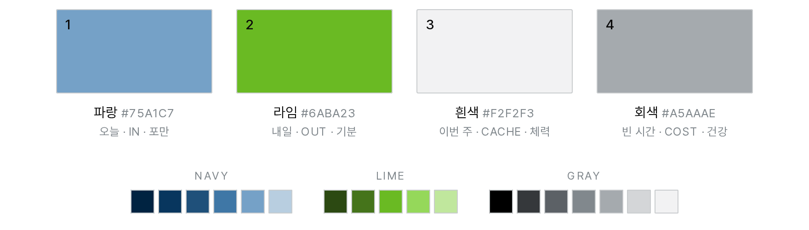
  </picture>
</p>
<p align="center"><sub>PALETTE · works 공통 · <a href="../docs/DESIGN.md">DESIGN.md</a></sub></p>

<br>

<h3 align="center">works 시스템.</h3>

<p align="center">
Terminal–1 은 works 시스템의 한 부품입니다.<br>
같은 팔레트, 같은 번호 라벨, 같은 인코더 색으로 만든 사내 도구들.<br>
전부 받아서 바로 실행하고, 전부 내 PC 에서만 돕니다.
</p>

<p align="center"><a href="../README.md">explore ›</a></p>

<p align="center">
  <picture>
    <source media="(prefers-color-scheme: dark)" srcset="../docs/page/system-dark.jpg">
    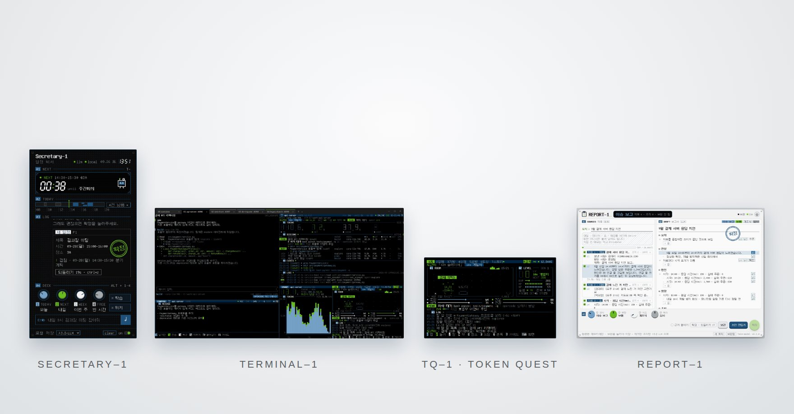
  </picture>
</p>

<br>

<p align="center">
  <picture>
    <source media="(prefers-color-scheme: dark)" srcset="docs/images/page/certified-dark.png">
    
  </picture>
</p>

<p align="center">
TOKEN QUEST 7장 「야근의 탑」의 챕터 보스는 크런치 타임 거인입니다.<br>
미션을 다 채우면 도전할 수 있고, 져도 기절 페널티는 없습니다.<br>
현실의 야근은… 되도록 피하세요.
</p>

<br>

<p align="center"><sub>EXPLORE WORKS SYSTEM COMPONENTS:</sub></p>

<p align="center">
  <picture>
    <source media="(prefers-color-scheme: dark)" srcset="../docs/page/parts-dark.jpg">
    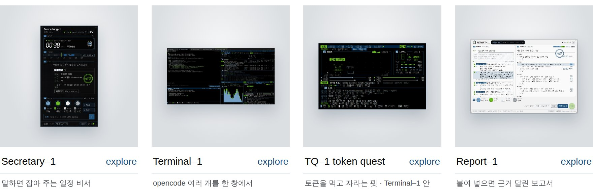
  </picture>
</p>

<p align="center">
<a href="docs/MANUAL.md">Terminal–1 ›</a> &nbsp;·&nbsp;
<a href="docs/MANUAL.md#06-token-quest">TQ–1 token quest ›</a> &nbsp;·&nbsp;
<a href="../README.md">works 의 다른 부품 ›</a>
</p>

<br>

<a name="specs"></a>
<h3 align="center">사양.</h3>

<table align="center">
<tr><td width="140">실행</td><td width="560">Windows 10 / 11 · Windows Terminal · PowerShell 5.1+ · Python 3.8+ · opencode CLI</td></tr>
<tr><td>의존성</td><td>없음 — 표준 라이브러리만 · <code>pip install</code> 없이 폴더 + PATH 가 전부</td></tr>
<tr><td>채널</td><td><code>terminal-1 add</code> 한 번에 탭 하나 · 4096 번부터 빈 포트 · 채널 번호는 바뀌지 않음</td></tr>
<tr><td>칸</td><td>opencode · status · compose · usage · TOKEN QUEST · <code>-NoPet</code> <code>-Compact</code> <code>-NoLogs</code> <code>-NoCompose</code></td></tr>
<tr><td>연결</td><td>opencode HTTP (<code>/session</code> · <code>/session/status</code> · <code>/message</code> · <code>/todo</code>) + SSE <code>/event</code> · 같은 서버 조회는 한 칸만</td></tr>
<tr><td>보안</td><td>서버 비밀번호는 명령줄 대신 파일로 · compose 로 보낸 글은 디스크에 남기지 않음</td></tr>
<tr><td>저장</td><td><code>%LOCALAPPDATA%\terminal-1\</code> — <code>instances.json</code> · <code>pet-*.json</code> · <code>raid-*.json</code> · <code>poll-*.json</code></td></tr>
<tr><td>화면</td><td>Terminal-1 Black 색 테마 · GNU Unifont 15.1.01 추천 · 폭 1칸 아이콘만</td></tr>
<tr><td>테스트</td><td>unittest 125 · <code>terminal-1.ps1</code> 실제 실행(pwsh · 가짜 wt) · CI Windows + Ubuntu × Python 3.8 · 3.13</td></tr>
</table>

<br>

<a name="install"></a>
<h3 align="center">설치.</h3>

<p align="center">opencode 를 열고 <code>D:\OPENCODE\terminal-1\INSTALL.md 를 읽고 순서대로 Terminal-1 설치를 진행해줘</code> 라고 하면 됩니다.<br>works 저장소를 <code>D:\OPENCODE</code> 에 한 번 받으면 Secretary–1 도 같이 들어 있습니다. 직접 할 때는:</p>

```powershell
git clone https://github.com/leebobegogigug-blip/Works.git D:\OPENCODE

# 사용자 PATH 에 추가 (새로 연 터미널부터 적용)
$p = [Environment]::GetEnvironmentVariable('Path', 'User')
[Environment]::SetEnvironmentVariable('Path', "$p;D:\OPENCODE\terminal-1", 'User')

cd C:\work\api-server
terminal-1 add       # 현재 폴더 → 새 채널 (처음이면 00 overview 탭도 함께)
```

<p align="center">처음 <code>terminal-1 add</code> 뒤에는 Windows Terminal 창을 모두 한 번 닫았다가 여세요. <code>Terminal-1 Black</code> 테마가 그때 로드됩니다.</p>

<br>

<h3 align="center">설치비 0원 · pip install 0번*<br>반품은 terminal-1 rm 한 번*</h3>

<p align="center"><sub>*opencode · Windows Terminal · Python 은 따로. <code>terminal-1 rm</code> 은 등록을 풀고 headless 서버를 끕니다 — 펫 저장은 남습니다. 정이 들었으니까요. PATH · 색 테마까지 걷어 내는 순서는 <a href="INSTALL.md#제거">INSTALL.md › 제거</a></sub></p>

<br>

<table align="center">
<tr><td width="620"><a href="docs/MANUAL.md">매뉴얼</a> <sub>· 명령 · 레이아웃 · 키 · 화면 · 구조</sub></td><td align="right" width="40">›</td></tr>
<tr><td><a href="INSTALL.md">설치 가이드</a> <sub>· opencode 에이전트용 단계별 절차 · 업데이트 · 제거</sub></td><td align="right">›</td></tr>
<tr><td><a href="docs/MANUAL.md#06-token-quest">TOKEN QUEST</a> <sub>· 돌봄 · 진화 · 모험 · 레이드 · 메인 스토리</sub></td><td align="right">›</td></tr>
<tr><td><a href="../docs/DESIGN.md">디자인</a> <sub>· works 공통 원칙 일곱 가지 · 팔레트 · 이 앱에서는 <a href="docs/MANUAL.md#07-디자인">MANUAL › 07</a></sub></td><td align="right">›</td></tr>
<tr><td><a href="docs/GUIDE.md">GUIDE (English)</a> <sub>· detailed manual</sub></td><td align="right">›</td></tr>
<tr><td><a href="https://github.com/leebobegogigug-blip/Works/issues">문제 알리기</a> <sub>· 이슈</sub></td><td align="right">›</td></tr>
<tr><td><a href="../README.md">works</a> <sub>· 시스템 전체 · 다른 부품</sub></td><td align="right">›</td></tr>
</table>

<br>

<p align="center">
  <picture>
    <source media="(prefers-color-scheme: dark)" srcset="../docs/page/colophon-dark.png">
    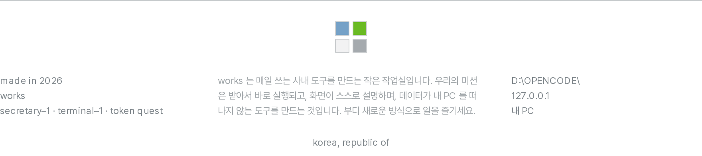
  </picture>
</p>

<p align="center"><sub>
Terminal–1 · 창은 하나, 펫은 여럿. 토큰을 너무 많이 먹이지 마세요. 진화합니다.<br>
화면 문법은 소형 하드웨어 계측기(Teenage Engineering 류)에서 영감을 받았고, 해당 회사와는 관련이 없습니다.
</sub></p>
